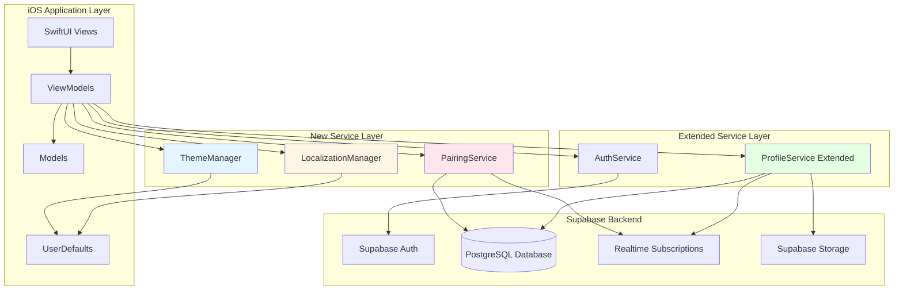
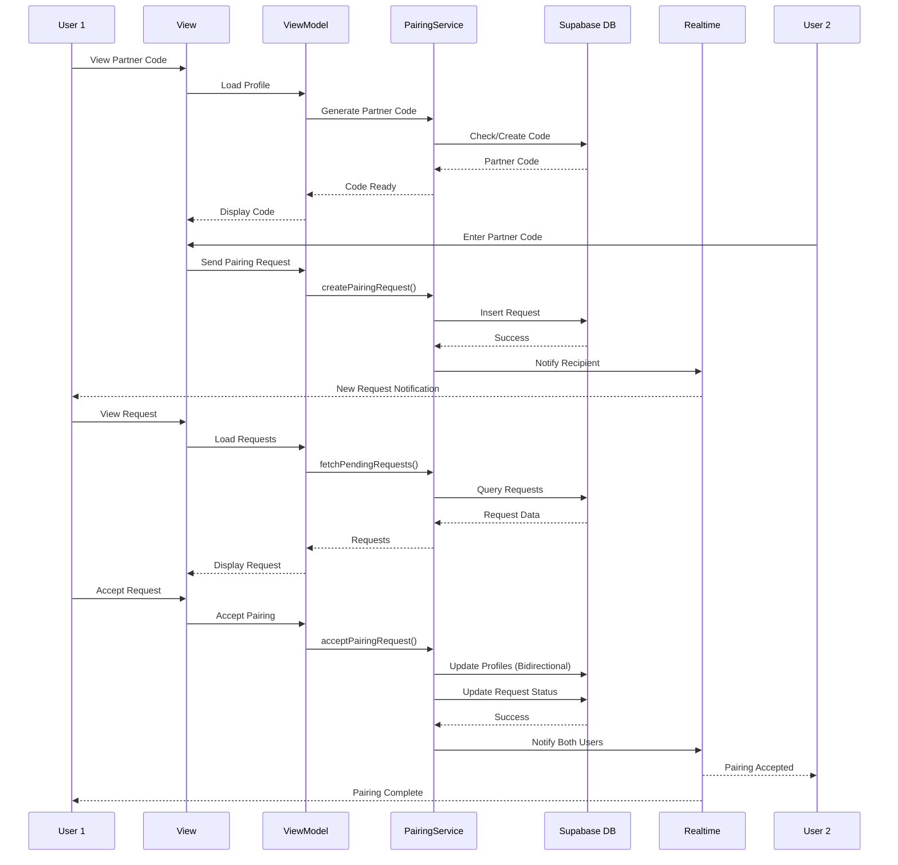
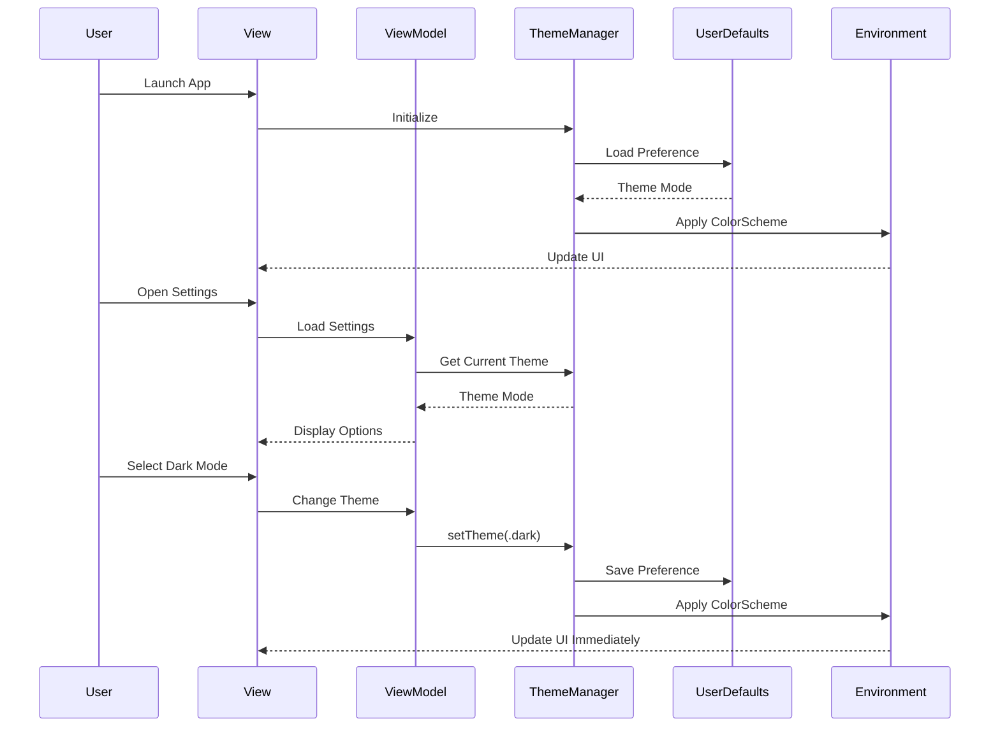
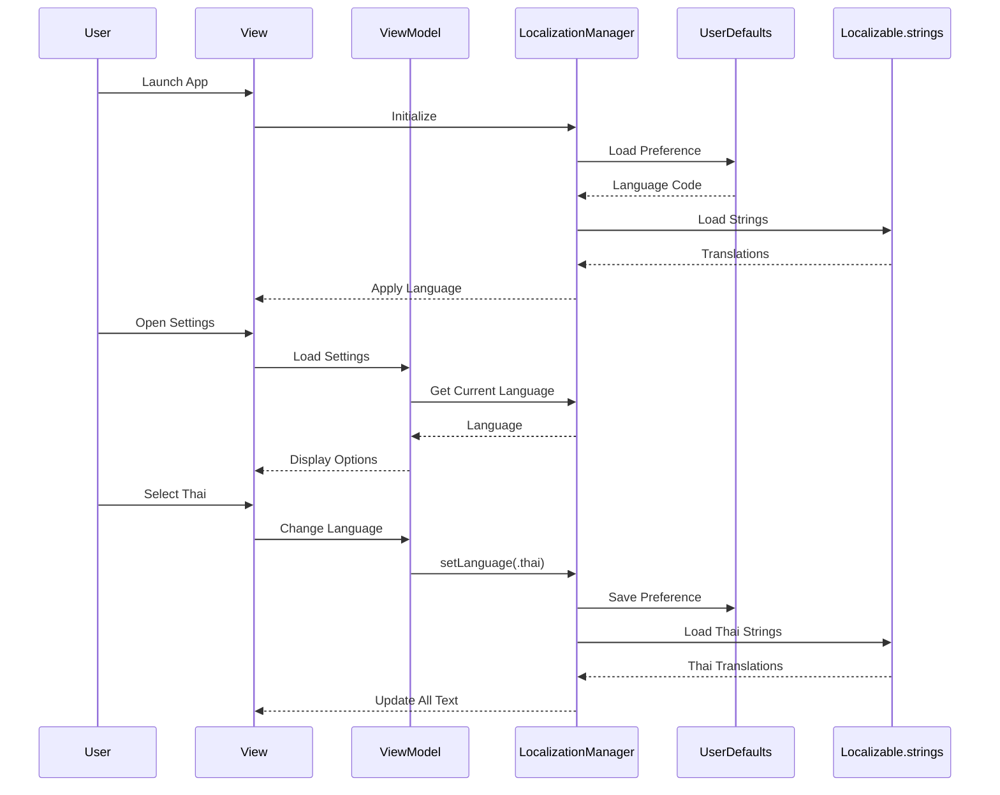

# Design Document: Additional Features Enhancement

## Overview

เอกสารนี้กำหนดการออกแบบสำหรับฟีเจอร์เพิ่มเติม 4 ระบบหลักของ Couple Quest iOS App ได้แก่ Partner Pairing System, Profile Management System, Theme System (Dark/Light Mode), และ Localization System (Thai/English) การออกแบบนี้จะขยายความสามารถของแอพพลิเคชันที่มีอยู่แล้ว โดยรักษา backward compatibility กับ database schema และ architecture ที่มีอยู่

ระบบทั้งหมดถูกออกแบบให้ทำงานร่วมกับ SwiftUI + MVVM architecture ที่มีอยู่ โดยใช้ Supabase เป็น backend และรองรับ real-time synchronization ระหว่าง partners การออกแบบเน้นที่ user experience ที่ราบรื่น, data consistency, และ accessibility

**Key Design Principles:**

- Maintain existing MVVM architecture patterns
- Extend existing services without breaking changes
- Use UserDefaults for client-side preferences (theme, language)
- Use Supabase PostgreSQL for server-side data (profiles, pairing)
- Support real-time synchronization for partner data
- Ensure backward compatibility with existing database schema
- Follow iOS Human Interface Guidelines for accessibility

## Architecture

### System Architecture Overview



### Partner Pairing Flow



### Theme System Flow



### Localization System Flow



## Components and Interfaces

### Component 1: PairingService

**Purpose**: จัดการระบบ partner pairing ผ่าน partner code, pairing requests, และ bidirectional relationships

**Interface**:

```swift
class PairingService {
    static let shared: PairingService

    // Partner Code Management
    func generatePartnerCode(userId: UUID) async throws -> String
    func findUserByPartnerCode(_ code: String) async throws -> UUID?

    // Pairing Request Management
    func createPairingRequest(from requesterId: UUID, to recipientCode: String) async throws -> PairingRequest
    func fetchPendingRequests(userId: UUID) async throws -> [PairingRequest]
    func acceptPairingRequest(requestId: UUID) async throws
    func rejectPairingRequest(requestId: UUID) async throws

    // Pairing Operations
    func pairUsers(userId: UUID, partnerId: UUID) async throws
    func unpairUsers(userId: UUID) async throws

    // Realtime Subscriptions
    func subscribeToRequests(userId: UUID, handler: @escaping ([PairingRequest]) -> Void) async throws
    func unsubscribeFromRequests() async
}
```

**Responsibilities**:

- สร้างและจัดการ partner codes ที่ unique
- จัดการ pairing requests (create, accept, reject)
- สร้าง bidirectional partner relationships
- ตรวจสอบ validation (ไม่ให้ pair กับตัวเอง, ไม่ให้ pair ซ้ำ)
- Real-time notifications สำหรับ pairing requests
- ลบ requests ที่เก่าเกิน 7 วัน

**Formal Specifications**:

**Preconditions**:

- Supabase client ต้อง initialized และ connected
- User ต้อง authenticated (มี valid session)
- สำหรับ generatePartnerCode: userId ต้องมีอยู่ใน profiles table
- สำหรับ createPairingRequest: recipient code ต้องมีอยู่และไม่ใช่ของ requester
- สำหรับ acceptPairingRequest: request ต้องมี status = 'pending'

**Postconditions**:

- generatePartnerCode: สร้าง code 6-8 ตัวอักษร alphanumeric ที่ unique
- createPairingRequest: สร้าง request record ใน database พร้อม send notification
- acceptPairingRequest: อัพเดท partner_id ของทั้งสอง users (bidirectional) และเปลี่ยน request status เป็น 'accepted'
- rejectPairingRequest: เปลี่ยน request status เป็น 'rejected' และ notify requester
- pairUsers: สร้าง bidirectional relationship (user.partner_id = partner, partner.partner_id = user)
- unpairUsers: ลบ partner_id จากทั้งสอง profiles

**Invariants**:

- Partner codes ต้อง unique ใน profiles table
- Partner relationships ต้องเป็น bidirectional เสมอ (ถ้า A.partner_id = B แล้ว B.partner_id = A)
- User ไม่สามารถมี partner_id เป็นตัวเองได้
- User สามารถมี partner ได้แค่คนเดียวในเวลาเดียวกัน
- Pairing requests ที่เก่ากว่า 7 วันจะถูกลบอัตโนมัติ

---

### Component 2: ThemeManager

**Purpose**: จัดการ theme preferences (light/dark/system) และ apply color schemes ทั่วทั้งแอพ

**Interface**:

```swift
@MainActor
class ThemeManager: ObservableObject {
    static let shared: ThemeManager

    @Published var currentTheme: ThemeMode

    enum ThemeMode: String, CaseIterable {
        case light
        case dark
        case system

        var displayName: String
        var colorScheme: ColorScheme?
    }

    func setTheme(_ mode: ThemeMode)
    func loadSavedTheme()
    func getColorScheme() -> ColorScheme?
}
```

**Responsibilities**:

- จัดเก็บและโหลด theme preference จาก UserDefaults
- Apply color scheme ให้กับ SwiftUI environment
- รองรับ 3 modes: light, dark, system
- Publish theme changes ให้ UI อัพเดททันที
- ใช้ system theme เป็น default

**Formal Specifications**:

**Preconditions**:

- ThemeManager ต้อง initialized ก่อน app launch
- UserDefaults ต้อง accessible

**Postconditions**:

- setTheme: บันทึก preference ลง UserDefaults และ publish change ทันที
- loadSavedTheme: โหลด preference จาก UserDefaults หรือใช้ .system เป็น default
- getColorScheme: return .light, .dark, หรือ nil (สำหรับ system mode)
- Theme changes apply ทันทีโดยไม่ต้อง restart app

**Invariants**:

- currentTheme ต้องเป็น 1 ใน 3 modes เสมอ
- Theme preference persist across app launches
- Theme changes trigger UI updates on main thread
- System mode follows iOS appearance settings

---

### Component 3: LocalizationManager

**Purpose**: จัดการ language preferences (Thai/English) และ provide localized strings

**Interface**:

```swift
@MainActor
class LocalizationManager: ObservableObject {
    static let shared: LocalizationManager

    @Published var currentLanguage: Language

    enum Language: String, CaseIterable {
        case english = "en"
        case thai = "th"

        var displayName: String
        var locale: Locale
    }

    func setLanguage(_ language: Language)
    func loadSavedLanguage()
    func localized(_ key: String) -> String
    func localized(_ key: String, _ args: CVarArg...) -> String
}
```

**Responsibilities**:

- จัดเก็บและโหลด language preference จาก UserDefaults
- Provide localized strings จาก Localizable.strings files
- รองรับ 2 ภาษา: Thai และ English
- Format dates และ numbers ตาม locale
- Fallback เป็น English ถ้าไม่มี translation
- Publish language changes ให้ UI อัพเดททันที

**Formal Specifications**:

**Preconditions**:

- LocalizationManager ต้อง initialized ก่อน app launch
- Localizable.strings files ต้องมีทั้ง en และ th
- UserDefaults ต้อง accessible

**Postconditions**:

- setLanguage: บันทึก preference ลง UserDefaults และ publish change ทันที
- loadSavedLanguage: โหลด preference จาก UserDefaults หรือใช้ .english เป็น default
- localized: return translated string หรือ fallback เป็น English ถ้าไม่มี key
- Language changes apply ทันทีโดยไม่ต้อง restart app

**Invariants**:

- currentLanguage ต้องเป็น 1 ใน 2 languages เสมอ
- Language preference persist across app launches
- Missing translations fallback เป็น English
- Language changes trigger UI updates on main thread
- Date/number formatting ตาม selected locale

---

### Component 4: ProfileService Extensions

**Purpose**: ขยาย ProfileService ที่มีอยู่เพื่อรองรับ partner codes, profile pictures, และ preference updates

**New Methods**:

```swift
extension ProfileService {
    // Partner Code
    func updatePartnerCode(userId: UUID, code: String) async throws
    func fetchProfileByPartnerCode(_ code: String) async throws -> Profile?

    // Profile Picture
    func uploadProfilePicture(userId: UUID, imageData: Data) async throws -> String
    func deleteProfilePicture(userId: UUID) async throws

    // Username (Display Name)
    func updateUsername(userId: UUID, username: String) async throws
    func validateUsername(_ username: String) -> Bool

    // Preferences (stored in database for sync)
    func updateThemePreference(userId: UUID, theme: String) async throws
    func updateLanguagePreference(userId: UUID, language: String) async throws
}
```

**Responsibilities**:

- จัดการ partner code ใน profiles table
- อัพโหลดและลบ profile pictures ใน Supabase Storage
- Validate และอัพเดท usernames
- จัดเก็บ theme และ language preferences ใน database (optional, สำหรับ sync)
- รักษา backward compatibility กับ existing ProfileService methods

**Formal Specifications**:

**Preconditions**:

- userId ต้องมีอยู่ใน profiles table
- สำหรับ updatePartnerCode: code ต้อง unique และ 6-8 characters
- สำหรับ uploadProfilePicture: imageData ต้องเป็น valid image format (JPEG/PNG)
- สำหรับ updateUsername: username ต้อง pass validation (1-50 chars, no special chars)

**Postconditions**:

- updatePartnerCode: อัพเดท partner_code column ใน profiles table
- uploadProfilePicture: อัพโหลดไปที่ Supabase Storage bucket "profile-pictures" และ return URL
- deleteProfilePicture: ลบไฟล์จาก Storage และ clear profile_picture_url
- updateUsername: อัพเดท username column หลัง validation ผ่าน
- Preference updates: อัพเดท theme_preference และ language_preference columns

**Invariants**:

- Partner codes ต้อง unique across all profiles
- Profile picture URLs ต้อง valid และ accessible
- Usernames ต้อง pass validation rules
- Existing ProfileService functionality ต้องไม่เสีย (backward compatible)

---

### Component 5: AppTheme Extensions

**Purpose**: ขยาย AppTheme.swift เพื่อรองรับ dark mode colors และ adaptive colors

**New Properties**:

```swift
extension AppTheme {
    // Adaptive Colors (support both light and dark)
    static var primaryBackground: Color
    static var secondaryBackground: Color
    static var tertiaryBackground: Color
    static var primaryText: Color
    static var secondaryText: Color
    static var tertiaryText: Color
    static var separator: Color
    static var cardBackground: Color

    // Dark Mode Specific Gradients
    static var primaryGradientDark: LinearGradient
    static var secondaryGradientDark: LinearGradient
    static var backgroundGradientDark: LinearGradient

    // Adaptive Gradient (switches based on color scheme)
    static func adaptiveGradient(light: LinearGradient, dark: LinearGradient) -> LinearGradient
}
```

**Responsibilities**:

- Define semantic colors ที่ adapt ตาม light/dark mode
- Provide dark mode versions ของ gradients
- ใช้ SwiftUI Color.primary, Color.secondary สำหรับ text
- ใช้ Color(.systemBackground) สำหรับ backgrounds
- รักษา existing colors สำหรับ backward compatibility

**Formal Specifications**:

**Preconditions**:

- SwiftUI environment ต้องมี colorScheme value
- iOS 13+ (สำหรับ dark mode support)

**Postconditions**:

- Adaptive colors return ค่าที่ถูกต้องตาม current color scheme
- Text colors มี contrast ratio ≥ 4.5:1 (WCAG AA standard)
- Background colors แตกต่างกันชัดเจนระหว่าง light และ dark mode
- Existing code ที่ใช้ AppTheme ยังทำงานได้ปกติ

**Invariants**:

- Colors ต้อง accessible ใน both light และ dark modes
- Semantic color names ต้อง consistent (เช่น primaryBackground, secondaryText)
- Gradients ต้องมี visibility ดีใน both modes

## Data Models

### Model 1: Profile (Extended)

```swift
struct Profile: Identifiable, Codable {
    let id: UUID
    var displayName: String?
    var username: String?              // NEW: Display name for UI
    var partnerId: UUID?
    var partnerCode: String?           // NEW: Unique code for pairing
    var profilePictureUrl: String?     // NEW: URL to profile picture in Storage
    var themePreference: String?       // NEW: "light", "dark", "system"
    var languagePreference: String?    // NEW: "en", "th"
    var totalPoints: Int
    var createdAt: Date
    var updatedAt: Date

    enum CodingKeys: String, CodingKey {
        case id
        case displayName = "display_name"
        case username
        case partnerId = "partner_id"
        case partnerCode = "partner_code"
        case profilePictureUrl = "profile_picture_url"
        case themePreference = "theme_preference"
        case languagePreference = "language_preference"
        case totalPoints = "total_points"
        case createdAt = "created_at"
        case updatedAt = "updated_at"
    }
}

extension Profile {
    // Validation
    static func isValidUsername(_ username: String) -> Bool {
        let trimmed = username.trimmingCharacters(in: .whitespaces)
        guard trimmed.count >= 1 && trimmed.count <= 50 else { return false }

        // Allow letters, numbers, spaces, hyphens, underscores
        let allowedCharacters = CharacterSet.alphanumerics
            .union(CharacterSet(charactersIn: " -_"))
        return trimmed.unicodeScalars.allSatisfy { allowedCharacters.contains($0) }
    }

    static func isValidPartnerCode(_ code: String) -> Bool {
        let trimmed = code.trimmingCharacters(in: .whitespaces).uppercased()
        guard trimmed.count >= 6 && trimmed.count <= 8 else { return false }

        // Only alphanumeric characters
        return trimmed.allSatisfy { $0.isLetter || $0.isNumber }
    }
}
```

**Validation Rules**:

- id: UUID matching auth.users.id
- displayName: optional, legacy field (kept for backward compatibility)
- username: 1-50 characters, alphanumeric + spaces/hyphens/underscores
- partnerId: must reference existing profile or be nil
- partnerCode: 6-8 characters, alphanumeric only, unique across all profiles
- profilePictureUrl: valid URL to Supabase Storage or nil
- themePreference: "light", "dark", or "system" (default: "system")
- languagePreference: "en" or "th" (default: "en")
- totalPoints: non-negative integer
- Partner relationship must be bidirectional when set

---

### Model 2: PairingRequest

```swift
struct PairingRequest: Identifiable, Codable {
    let id: UUID
    let requesterId: UUID
    let recipientId: UUID
    var status: RequestStatus
    let createdAt: Date
    var updatedAt: Date

    // Computed properties for UI
    var requesterProfile: Profile?     // Loaded separately
    var recipientProfile: Profile?     // Loaded separately

    enum RequestStatus: String, Codable {
        case pending
        case accepted
        case rejected
    }

    enum CodingKeys: String, CodingKey {
        case id
        case requesterId = "requester_id"
        case recipientId = "recipient_id"
        case status
        case createdAt = "created_at"
        case updatedAt = "updated_at"
    }
}

extension PairingRequest {
    var isPending: Bool {
        status == .pending
    }

    var isExpired: Bool {
        // Requests older than 7 days are considered expired
        let sevenDaysAgo = Calendar.current.date(byAdding: .day, value: -7, to: Date())!
        return createdAt < sevenDaysAgo
    }
}
```

**Validation Rules**:

- id: auto-generated UUID
- requesterId: must reference existing profile
- recipientId: must reference existing profile, cannot equal requesterId
- status: defaults to 'pending', can transition to 'accepted' or 'rejected'
- createdAt: auto-set to current timestamp
- updatedAt: auto-updated on status changes
- Requests older than 7 days should be automatically deleted
- Only one pending request allowed between same two users

---

### Model 3: ThemePreference

```swift
enum ThemeMode: String, Codable, CaseIterable {
    case light
    case dark
    case system

    var displayName: String {
        switch self {
        case .light: return "Light"
        case .dark: return "Dark"
        case .system: return "System"
        }
    }

    var localizedDisplayName: String {
        switch self {
        case .light: return LocalizationManager.shared.localized("theme.light")
        case .dark: return LocalizationManager.shared.localized("theme.dark")
        case .system: return LocalizationManager.shared.localized("theme.system")
        }
    }

    var colorScheme: ColorScheme? {
        switch self {
        case .light: return .light
        case .dark: return .dark
        case .system: return nil  // Use system default
        }
    }

    var icon: String {
        switch self {
        case .light: return "sun.max.fill"
        case .dark: return "moon.fill"
        case .system: return "circle.lefthalf.filled"
        }
    }
}
```

**Storage**:

- Stored in UserDefaults with key "theme_preference"
- Also optionally stored in database for cross-device sync
- Default value: .system

---

### Model 4: LanguagePreference

```swift
enum Language: String, Codable, CaseIterable {
    case english = "en"
    case thai = "th"

    var displayName: String {
        switch self {
        case .english: return "English"
        case .thai: return "ไทย"
        }
    }

    var locale: Locale {
        Locale(identifier: rawValue)
    }

    var flag: String {
        switch self {
        case .english: return "🇬🇧"
        case .thai: return "🇹🇭"
        }
    }

    var code: String {
        rawValue
    }
}
```

**Storage**:

- Stored in UserDefaults with key "language_preference"
- Also optionally stored in database for cross-device sync
- Default value: .english

---

### Model 5: ProfilePictureUpload

```swift
struct ProfilePictureUpload {
    let userId: UUID
    let imageData: Data
    let fileName: String

    var storagePath: String {
        "profile-pictures/\(userId.uuidString)/\(fileName)"
    }

    static func generateFileName() -> String {
        "\(UUID().uuidString).jpg"
    }

    static func resizeImage(_ image: UIImage, maxSize: CGFloat = 512) -> Data? {
        let size = image.size
        let ratio = min(maxSize / size.width, maxSize / size.height)
        let newSize = CGSize(width: size.width * ratio, height: size.height * ratio)

        UIGraphicsBeginImageContextWithOptions(newSize, false, 1.0)
        image.draw(in: CGRect(origin: .zero, size: newSize))
        let resizedImage = UIGraphicsGetImageFromCurrentImageContext()
        UIGraphicsEndImageContext()

        return resizedImage?.jpegData(compressionQuality: 0.8)
    }
}
```

**Validation Rules**:

- imageData: must be valid JPEG or PNG format
- Maximum file size: 5MB (before resize)
- Resized to maximum 512x512 pixels
- Stored in Supabase Storage bucket "profile-pictures"
- File path format: "profile-pictures/{userId}/{uuid}.jpg"

## Database Schema Extensions

### Migration: Add Partner Pairing and Preferences

```sql
-- ============================================================================
-- Additional Features Enhancement Migration
-- ============================================================================
-- This migration adds support for partner pairing, profile pictures,
-- theme preferences, and localization preferences
-- ============================================================================

-- Add new columns to profiles table
ALTER TABLE profiles
ADD COLUMN IF NOT EXISTS username TEXT,
ADD COLUMN IF NOT EXISTS partner_code TEXT UNIQUE,
ADD COLUMN IF NOT EXISTS profile_picture_url TEXT,
ADD COLUMN IF NOT EXISTS theme_preference TEXT DEFAULT 'system' CHECK (theme_preference IN ('light', 'dark', 'system')),
ADD COLUMN IF NOT EXISTS language_preference TEXT DEFAULT 'en' CHECK (language_preference IN ('en', 'th'));

-- Add constraints
ALTER TABLE profiles
ADD CONSTRAINT username_length CHECK (char_length(username) >= 1 AND char_length(username) <= 50),
ADD CONSTRAINT partner_code_format CHECK (partner_code ~ '^[A-Z0-9]{6,8}$');

-- Create index for partner code lookups
CREATE INDEX IF NOT EXISTS idx_profiles_partner_code ON profiles(partner_code) WHERE partner_code IS NOT NULL;

-- Create index for username searches
CREATE INDEX IF NOT EXISTS idx_profiles_username ON profiles(username) WHERE username IS NOT NULL;

-- ============================================================================
-- Pairing Requests Table
-- ============================================================================

CREATE TABLE IF NOT EXISTS pairing_requests (
  id UUID PRIMARY KEY DEFAULT gen_random_uuid(),
  requester_id UUID REFERENCES profiles(id) ON DELETE CASCADE NOT NULL,
  recipient_id UUID REFERENCES profiles(id) ON DELETE CASCADE NOT NULL,
  status TEXT DEFAULT 'pending' CHECK (status IN ('pending', 'accepted', 'rejected')),
  created_at TIMESTAMP WITH TIME ZONE DEFAULT NOW(),
  updated_at TIMESTAMP WITH TIME ZONE DEFAULT NOW(),

  -- Constraints
  CONSTRAINT different_users CHECK (requester_id != recipient_id),
  CONSTRAINT unique_pending_request UNIQUE (requester_id, recipient_id, status)
);

-- Indexes for pairing requests
CREATE INDEX IF NOT EXISTS idx_pairing_requests_requester ON pairing_requests(requester_id);
CREATE INDEX IF NOT EXISTS idx_pairing_requests_recipient ON pairing_requests(recipient_id);
CREATE INDEX IF NOT EXISTS idx_pairing_requests_status ON pairing_requests(status);
CREATE INDEX IF NOT EXISTS idx_pairing_requests_created_at ON pairing_requests(created_at);

-- Trigger to update updated_at on pairing_requests
CREATE TRIGGER update_pairing_requests_updated_at
  BEFORE UPDATE ON pairing_requests
  FOR EACH ROW
  EXECUTE FUNCTION update_updated_at_column();

-- ============================================================================
-- Functions
-- ============================================================================

-- Function to generate unique partner code
CREATE OR REPLACE FUNCTION generate_partner_code()
RETURNS TEXT AS $$
DECLARE
  code TEXT;
  exists BOOLEAN;
BEGIN
  LOOP
    -- Generate random 8-character alphanumeric code
    code := upper(substring(md5(random()::text) from 1 for 8));

    -- Check if code already exists
    SELECT EXISTS(SELECT 1 FROM profiles WHERE partner_code = code) INTO exists;

    EXIT WHEN NOT exists;
  END LOOP;

  RETURN code;
END;
$$ LANGUAGE plpgsql;

-- Function to clean up old pairing requests (older than 7 days)
CREATE OR REPLACE FUNCTION cleanup_old_pairing_requests()
RETURNS void AS $$
BEGIN
  DELETE FROM pairing_requests
  WHERE status = 'pending'
  AND created_at < NOW() - INTERVAL '7 days';
END;
$$ LANGUAGE plpgsql;

-- Function to accept pairing request (atomic operation)
CREATE OR REPLACE FUNCTION accept_pairing_request(request_id UUID)
RETURNS void AS $$
DECLARE
  req_record RECORD;
BEGIN
  -- Get request details
  SELECT requester_id, recipient_id, status
  INTO req_record
  FROM pairing_requests
  WHERE id = request_id;

  -- Validate request exists and is pending
  IF NOT FOUND THEN
    RAISE EXCEPTION 'Pairing request not found';
  END IF;

  IF req_record.status != 'pending' THEN
    RAISE EXCEPTION 'Pairing request is not pending';
  END IF;

  -- Check if either user is already paired
  IF EXISTS(SELECT 1 FROM profiles WHERE id = req_record.requester_id AND partner_id IS NOT NULL) THEN
    RAISE EXCEPTION 'Requester is already paired';
  END IF;

  IF EXISTS(SELECT 1 FROM profiles WHERE id = req_record.recipient_id AND partner_id IS NOT NULL) THEN
    RAISE EXCEPTION 'Recipient is already paired';
  END IF;

  -- Update both profiles (bidirectional)
  UPDATE profiles
  SET partner_id = req_record.recipient_id, updated_at = NOW()
  WHERE id = req_record.requester_id;

  UPDATE profiles
  SET partner_id = req_record.requester_id, updated_at = NOW()
  WHERE id = req_record.recipient_id;

  -- Update request status
  UPDATE pairing_requests
  SET status = 'accepted', updated_at = NOW()
  WHERE id = request_id;
END;
$$ LANGUAGE plpgsql SECURITY DEFINER;

-- ============================================================================
-- Row Level Security Policies
-- ============================================================================

-- Enable RLS on pairing_requests
ALTER TABLE pairing_requests ENABLE ROW LEVEL SECURITY;

-- Users can view requests where they are requester or recipient
CREATE POLICY "Users can view own pairing requests"
  ON pairing_requests FOR SELECT
  USING (
    auth.uid() = requester_id OR
    auth.uid() = recipient_id
  );

-- Users can create pairing requests
CREATE POLICY "Users can create pairing requests"
  ON pairing_requests FOR INSERT
  WITH CHECK (auth.uid() = requester_id);

-- Users can update requests where they are recipient (for accept/reject)
CREATE POLICY "Recipients can update pairing requests"
  ON pairing_requests FOR UPDATE
  USING (auth.uid() = recipient_id)
  WITH CHECK (auth.uid() = recipient_id);

-- Users can delete their own sent requests
CREATE POLICY "Requesters can delete own requests"
  ON pairing_requests FOR DELETE
  USING (auth.uid() = requester_id);

-- ============================================================================
-- Storage Bucket for Profile Pictures
-- ============================================================================

-- Create storage bucket (run via Supabase dashboard or API)
-- Bucket name: profile-pictures
-- Public: false
-- File size limit: 5MB
-- Allowed MIME types: image/jpeg, image/png

-- Storage policies (to be created in Supabase dashboard)
-- 1. Users can upload to their own folder: profile-pictures/{user_id}/*
-- 2. Users can view their own and their partner's profile pictures
-- 3. Users can delete their own profile pictures

```

## Algorithms

### Algorithm 1: Partner Pairing with Code

```swift
func createPairingRequest(from requesterId: UUID, to recipientCode: String) async throws -> PairingRequest {
    // INPUT: requesterId (UUID), recipientCode (String)
    // OUTPUT: PairingRequest
    // PRECONDITION: requester exists, code is valid format, recipient exists
    // POSTCONDITION: pairing request created, recipient notified

    // Step 1: Validate partner code format
    let code = recipientCode.trimmingCharacters(in: .whitespaces).uppercased()
    guard Profile.isValidPartnerCode(code) else {
        throw PairingError.invalidCode
    }

    // Step 2: Find recipient by partner code
    guard let recipient = try await client
        .from("profiles")
        .select()
        .eq("partner_code", value: code)
        .single()
        .execute()
        .value as Profile? else {
        throw PairingError.codeNotFound
    }

    // ASSERT: Recipient exists

    // Step 3: Validate not pairing with self
    guard requesterId != recipient.id else {
        throw PairingError.cannotPairWithSelf
    }

    // Step 4: Check if requester is already paired
    let requesterProfile = try await fetchProfile(userId: requesterId)
    guard requesterProfile.partnerId == nil else {
        throw PairingError.alreadyPaired
    }

    // Step 5: Check if recipient is already paired
    guard recipient.partnerId == nil else {
        throw PairingError.recipientAlreadyPaired
    }

    // Step 6: Check for existing pending request
    let existingRequests = try await client
        .from("pairing_requests")
        .select()
        .eq("requester_id", value: requesterId)
        .eq("recipient_id", value: recipient.id)
        .eq("status", value: "pending")
        .execute()
        .value as [PairingRequest]

    guard existingRequests.isEmpty else {
        throw PairingError.requestAlreadyExists
    }

    // Step 7: Create pairing request
    let newRequest = PairingRequest(
        id: UUID(),
        requesterId: requesterId,
        recipientId: recipient.id,
        status: .pending,
        createdAt: Date(),
        updatedAt: Date()
    )

    let request: PairingRequest = try await client
        .from("pairing_requests")
        .insert(newRequest)
        .select()
        .single()
        .execute()
        .value

    // ASSERT: Request created successfully

    // Step 8: Send notification to recipient (via realtime)
    // Realtime channel will automatically notify recipient

    print("✅ Pairing request created: \(requesterId) -> \(recipient.id)")

    return request

    // POSTCONDITION: Request exists in database with status='pending'
}
```

**Preconditions**:

- requesterId must reference existing profile in database
- recipientCode must be 6-8 alphanumeric characters
- Recipient with matching partner_code must exist
- Neither requester nor recipient can be already paired
- No existing pending request between same two users

**Postconditions**:

- PairingRequest record created with status='pending'
- Recipient receives real-time notification
- Request is queryable by both requester and recipient
- Request will auto-expire after 7 days if not acted upon

**Loop Invariants**: N/A (no loops in this algorithm)

---

### Algorithm 2: Accept Pairing Request

```swift
func acceptPairingRequest(requestId: UUID) async throws {
    // INPUT: requestId (UUID)
    // OUTPUT: Void (throws on error)
    // PRECONDITION: request exists with status='pending', neither user is paired
    // POSTCONDITION: both users paired bidirectionally, request status='accepted'

    // Step 1: Use database function for atomic operation
    // This ensures all validations and updates happen atomically
    try await client
        .rpc("accept_pairing_request", params: ["request_id": requestId])
        .execute()

    // POSTCONDITION:
    // - Both profiles have partner_id set to each other
    // - Request status updated to 'accepted'
    // - Realtime subscribers notified

    print("✅ Pairing request accepted: \(requestId)")
}
```

**Preconditions**:

- requestId must reference existing pairing_request
- Request status must be 'pending'
- Neither requester nor recipient can be already paired
- Both users must still exist in profiles table

**Postconditions**:

- Requester's partner_id = recipient's id
- Recipient's partner_id = requester's id
- Request status changed to 'accepted'
- Both users receive real-time notification
- All operations completed atomically (all-or-nothing)

**Loop Invariants**: N/A (atomic database operation)

---

### Algorithm 3: Generate Unique Partner Code

```swift
func generatePartnerCode(userId: UUID) async throws -> String {
    // INPUT: userId (UUID)
    // OUTPUT: String (unique 8-character code)
    // PRECONDITION: user exists in profiles table
    // POSTCONDITION: user has unique partner_code assigned

    // Step 1: Check if user already has a code
    let profile = try await fetchProfile(userId: userId)
    if let existingCode = profile.partnerCode {
        return existingCode
    }

    // Step 2: Generate unique code using database function
    let code: String = try await client
        .rpc("generate_partner_code")
        .single()
        .execute()
        .value

    // ASSERT: Code is unique (guaranteed by database function)

    // Step 3: Update profile with new code
    try await client
        .from("profiles")
        .update(["partner_code": code, "updated_at": Date().ISO8601Format()])
        .eq("id", value: userId)
        .execute()

    print("✅ Partner code generated for user \(userId): \(code)")

    return code

    // POSTCONDITION: User has unique partner_code in database
}
```

**Preconditions**:

- userId must reference existing profile
- Database function generate_partner_code() must be available

**Postconditions**:

- Profile has partner_code set to unique 8-character alphanumeric string
- Code is uppercase
- Code is unique across all profiles (enforced by database constraint)
- If user already had code, existing code is returned unchanged

**Loop Invariants**:

- Database function loops until unique code is found
- Each iteration generates new random code
- Loop terminates when code doesn't exist in profiles table

---

### Algorithm 4: Theme Application

```swift
func setTheme(_ mode: ThemeMode) {
    // INPUT: mode (ThemeMode)
    // OUTPUT: Void
    // PRECONDITION: ThemeManager is initialized
    // POSTCONDITION: theme applied and persisted

    // Step 1: Update published property (triggers UI update)
    self.currentTheme = mode

    // Step 2: Persist to UserDefaults
    UserDefaults.standard.set(mode.rawValue, forKey: "theme_preference")

    // Step 3: Apply to environment (handled by SwiftUI)
    // The @Published property change automatically updates all views
    // that observe ThemeManager

    print("✅ Theme changed to: \(mode.rawValue)")

    // POSTCONDITION:
    // - currentTheme updated
    // - Preference saved to UserDefaults
    // - UI updated immediately
}

func loadSavedTheme() {
    // INPUT: None
    // OUTPUT: Void
    // PRECONDITION: UserDefaults is accessible
    // POSTCONDITION: theme loaded from storage or default applied

    // Step 1: Load from UserDefaults
    guard let savedTheme = UserDefaults.standard.string(forKey: "theme_preference"),
          let mode = ThemeMode(rawValue: savedTheme) else {
        // Step 2: Use default if not found
        self.currentTheme = .system
        return
    }

    // Step 3: Apply loaded theme
    self.currentTheme = mode

    print("✅ Theme loaded: \(mode.rawValue)")

    // POSTCONDITION: currentTheme set to saved value or .system
}
```

**Preconditions**:

- ThemeManager must be initialized on MainActor
- UserDefaults must be accessible
- mode must be valid ThemeMode value

**Postconditions**:

- setTheme: currentTheme updated, preference saved, UI updates immediately
- loadSavedTheme: currentTheme set to saved preference or .system default
- Theme persists across app launches
- Changes apply without requiring app restart

**Loop Invariants**: N/A (no loops)

---

### Algorithm 5: Localization String Lookup

```swift
func localized(_ key: String, _ args: CVarArg...) -> String {
    // INPUT: key (String), args (variadic parameters)
    // OUTPUT: String (localized text)
    // PRECONDITION: Localizable.strings files exist for current language
    // POSTCONDITION: returns translated string or fallback

    // Step 1: Get bundle for current language
    guard let bundlePath = Bundle.main.path(forResource: currentLanguage.code, ofType: "lproj"),
          let bundle = Bundle(path: bundlePath) else {
        // Fallback to main bundle (English)
        return String(format: NSLocalizedString(key, comment: ""), arguments: args)
    }

    // Step 2: Look up localized string
    let localizedString = bundle.localizedString(forKey: key, value: nil, table: nil)

    // Step 3: Check if translation exists
    if localizedString == key {
        // Translation not found, fallback to English
        print("⚠️ Missing translation for key: \(key) in language: \(currentLanguage.code)")
        return String(format: NSLocalizedString(key, comment: ""), arguments: args)
    }

    // Step 4: Format with arguments if provided
    if args.isEmpty {
        return localizedString
    } else {
        return String(format: localizedString, arguments: args)
    }

    // POSTCONDITION: Returns translated string or English fallback
}
```

**Preconditions**:

- Localizable.strings files must exist for both "en" and "th"
- key must be valid string (can be any string, missing keys fallback to English)
- args must match format specifiers in localized string

**Postconditions**:

- Returns localized string for current language
- If translation missing, returns English version
- If English also missing, returns key itself
- Arguments are properly formatted into string
- No crashes on missing translations

**Loop Invariants**: N/A (no loops)

---

### Algorithm 6: Profile Picture Upload

```swift
func uploadProfilePicture(userId: UUID, imageData: Data) async throws -> String {
    // INPUT: userId (UUID), imageData (Data)
    // OUTPUT: String (URL to uploaded image)
    // PRECONDITION: user exists, imageData is valid image, size < 5MB
    // POSTCONDITION: image uploaded to Storage, URL saved in profile

    // Step 1: Validate image data
    guard let image = UIImage(data: imageData) else {
        throw ProfileError.invalidImageData
    }

    // Step 2: Resize image to max 512x512
    guard let resizedData = ProfilePictureUpload.resizeImage(image, maxSize: 512) else {
        throw ProfileError.imageResizeFailed
    }

    // ASSERT: Image is now ≤ 512x512 pixels

    // Step 3: Generate unique filename
    let fileName = ProfilePictureUpload.generateFileName()
    let storagePath = "profile-pictures/\(userId.uuidString)/\(fileName)"

    // Step 4: Delete old profile picture if exists
    let profile = try await fetchProfile(userId: userId)
    if let oldUrl = profile.profilePictureUrl {
        // Extract path from URL and delete
        let oldPath = extractStoragePath(from: oldUrl)
        try? await client.storage
            .from("profile-pictures")
            .remove(paths: [oldPath])
    }

    // Step 5: Upload to Supabase Storage
    let uploadedFile = try await client.storage
        .from("profile-pictures")
        .upload(
            path: storagePath,
            file: resizedData,
            options: FileOptions(contentType: "image/jpeg")
        )

    // ASSERT: File uploaded successfully

    // Step 6: Get public URL
    let publicURL = try client.storage
        .from("profile-pictures")
        .getPublicURL(path: storagePath)

    // Step 7: Update profile with new URL
    try await client
        .from("profiles")
        .update([
            "profile_picture_url": publicURL.absoluteString,
            "updated_at": Date().ISO8601Format()
        ])
        .eq("id", value: userId)
        .execute()

    print("✅ Profile picture uploaded for user \(userId)")

    return publicURL.absoluteString

    // POSTCONDITION: Image uploaded, URL saved in profile, old image deleted
}
```

**Preconditions**:

- userId must reference existing profile
- imageData must be valid JPEG or PNG format
- Original image size must be < 5MB
- Supabase Storage bucket "profile-pictures" must exist
- User must have upload permissions for their folder

**Postconditions**:

- Image resized to maximum 512x512 pixels
- Image uploaded to Storage at path "profile-pictures/{userId}/{uuid}.jpg"
- Profile's profile_picture_url updated with public URL
- Old profile picture deleted from Storage (if existed)
- Image is accessible via public URL

**Loop Invariants**: N/A (no loops)

## Correctness Properties

_A property is a characteristic or behavior that should hold true across all valid executions of a system-essentially, a formal statement about what the system should do. Properties serve as the bridge between human-readable specifications and machine-verifiable correctness guarantees._

### Property Reflection

Before defining properties, I analyzed all acceptance criteria for redundancy:

**Redundant Properties Identified:**

- 1.9 (bidirectional pairing) is redundant with 1.5 - both test the same bidirectional relationship
- 2.4 (unpaired status) is redundant with 2.3 - both test that partner_id is nil after unpairing
- 8.1 (theme persistence) is redundant with 7.4 - both test UserDefaults saving
- 13.5 (display requester name) is redundant with 1.4 - both test request contains requester info

**Combined Properties:**

- 3.3 and 3.4 (username validation) can be combined into one comprehensive validation property
- 7.3 and 7.4 (theme setting) can be combined into one property about theme changes
- 9.3 and 9.4 (language setting) can be combined into one property about language changes
- 10.1-10.7 (translation completeness) can be combined into one property about key existence

After reflection, the following unique properties provide comprehensive validation coverage:

### Property 1: Partner Code Uniqueness

_For any_ set of generated partner codes, all codes must be unique across the entire profiles table.

**Validates: Requirements 1.1, 6.2**

---

### Property 2: Partner Code Format Validation

_For any_ partner code, it must be 6-8 characters long and contain only alphanumeric characters (A-Z, 0-9).

**Validates: Requirements 1.2**

---

### Property 3: Pairing Request Creation

_For any_ valid partner code that exists in the system and belongs to a different user, entering that code must create a pairing request with status='pending'.

**Validates: Requirements 1.3**

---

### Property 4: Bidirectional Partner Relationship

_For any_ accepted pairing request, both users must have their partner_id set to reference each other (if user A's partner_id = B, then user B's partner_id = A).

**Validates: Requirements 1.5, 1.9**

---

### Property 5: Pairing Request Rejection

_For any_ pairing request that is rejected, the request status must change to 'rejected' and the request must no longer appear in pending requests.

**Validates: Requirements 1.6**

---

### Property 6: Self-Pairing Prevention

_For any_ user attempting to pair with their own partner code, the system must reject the request with an error.

**Validates: Requirements 1.7**

---

### Property 7: Already-Paired Prevention

_For any_ user attempting to pair with someone who already has a partner_id set, the system must reject the request with an error.

**Validates: Requirements 1.8**

---

### Property 8: Bidirectional Unpairing

_For any_ paired users, when one user initiates unpairing, both users must have their partner_id set to nil.

**Validates: Requirements 2.3, 2.4**

---

### Property 9: Re-pairing After Unpair

_For any_ user who has successfully unpaired, they must be able to create a new pairing request with a different partner code.

**Validates: Requirements 2.5**

---

### Property 10: Username Validation

_For any_ username string, it must be 1-50 characters long and contain only alphanumeric characters, spaces, hyphens, and underscores to be considered valid.

**Validates: Requirements 3.3, 3.4**

---

### Property 11: Username Persistence

_For any_ valid username that is saved, querying the database immediately after must return the same username.

**Validates: Requirements 3.5**

---

### Property 12: Invalid Username Rejection

_For any_ username that fails validation, attempting to save it must result in an error and the database must remain unchanged.

**Validates: Requirements 3.7**

---

### Property 13: Profile Picture Resize

_For any_ uploaded image, the system must resize it to a maximum of 512x512 pixels before storing.

**Validates: Requirements 5.4**

---

### Property 14: Profile Picture Storage Round-Trip

_For any_ uploaded profile picture, the returned URL must point to an accessible image in Supabase Storage.

**Validates: Requirements 5.5, 5.6**

---

### Property 15: Theme Mode Validation

_For any_ theme preference value, it must be one of "light", "dark", or "system" to be considered valid.

**Validates: Requirements 7.1**

---

### Property 16: Theme Persistence Round-Trip

_For any_ theme mode that is set, saving to UserDefaults and then loading must return the same theme mode.

**Validates: Requirements 7.4, 7.5, 8.1, 8.2**

---

### Property 17: Theme Independence from Auth

_For any_ theme preference, logging out and logging back in must preserve the same theme preference.

**Validates: Requirements 8.3**

---

### Property 18: System Theme Mode

_For any_ theme preference set to "system", the color scheme must be nil (allowing iOS to control appearance).

**Validates: Requirements 7.6**

---

### Property 19: Text Contrast Accessibility

_For any_ text color and background color combination in both light and dark modes, the contrast ratio must be ≥ 4.5:1 (WCAG AA standard).

**Validates: Requirements 7.8**

---

### Property 20: Language Mode Validation

_For any_ language preference value, it must be one of "en" or "th" to be considered valid.

**Validates: Requirements 9.1**

---

### Property 21: Language Persistence Round-Trip

_For any_ language that is set, saving to UserDefaults and then loading must return the same language.

**Validates: Requirements 9.4, 9.5**

---

### Property 22: Translation Key Completeness

_For any_ translation key used in the application, it must exist in both English and Thai Localizable.strings files.

**Validates: Requirements 9.6, 10.1, 10.2, 10.3, 10.4, 10.5, 10.6, 10.7**

---

### Property 23: Locale-Specific Formatting

_For any_ date or number, formatting with English locale must produce different output than formatting with Thai locale (demonstrating locale-aware formatting).

**Validates: Requirements 9.7**

---

### Property 24: Translation Fallback

_For any_ translation key that exists in English but not in Thai, the localization system must return the English translation as fallback.

**Validates: Requirements 10.8**

---

### Property 25: Pairing Request Data Completeness

_For any_ created pairing request, it must contain requester_id, recipient_id, status, and timestamps (created_at, updated_at).

**Validates: Requirements 13.2**

---

### Property 26: Pairing Request Status Transitions

_For any_ pairing request, accepting it must change status from 'pending' to 'accepted', and rejecting it must change status from 'pending' to 'rejected'.

**Validates: Requirements 13.7**

---

### Property 27: Automatic Request Cleanup

_For any_ pairing request with status='pending' that is older than 7 days, it must not appear in the list of pending requests (either deleted or filtered).

**Validates: Requirements 13.8**

---

### Property 28: Partner Code Service Extension

_For any_ profile service operation (generate code, upload picture, update username), the existing ProfileService methods must continue to work without errors (backward compatibility).

**Validates: Requirements 12.7**

## Error Handling

### Error Types and Handling Strategies

#### 1. PairingError

```swift
enum PairingError: LocalizedError {
    case invalidCode
    case codeNotFound
    case cannotPairWithSelf
    case alreadyPaired
    case recipientAlreadyPaired
    case requestAlreadyExists
    case requestNotFound
    case requestNotPending
    case networkError(String)

    var errorDescription: String? {
        switch self {
        case .invalidCode:
            return LocalizationManager.shared.localized("error.pairing.invalid_code")
        case .codeNotFound:
            return LocalizationManager.shared.localized("error.pairing.code_not_found")
        case .cannotPairWithSelf:
            return LocalizationManager.shared.localized("error.pairing.cannot_pair_self")
        case .alreadyPaired:
            return LocalizationManager.shared.localized("error.pairing.already_paired")
        case .recipientAlreadyPaired:
            return LocalizationManager.shared.localized("error.pairing.recipient_paired")
        case .requestAlreadyExists:
            return LocalizationManager.shared.localized("error.pairing.request_exists")
        case .requestNotFound:
            return LocalizationManager.shared.localized("error.pairing.request_not_found")
        case .requestNotPending:
            return LocalizationManager.shared.localized("error.pairing.request_not_pending")
        case .networkError(let message):
            return LocalizationManager.shared.localized("error.network", message)
        }
    }
}
```

**Handling Strategy**:

- Validate inputs before making network requests
- Show user-friendly error messages in UI
- Log detailed errors for debugging
- Retry network operations on transient failures
- Gracefully degrade when offline

---

#### 2. ProfileError Extensions

```swift
extension ProfileError {
    case invalidUsername
    case usernameTaken
    case invalidImageData
    case imageResizeFailed
    case imageTooLarge
    case uploadFailed(String)
    case invalidPartnerCode
    case partnerCodeTaken

    var errorDescription: String? {
        switch self {
        case .invalidUsername:
            return LocalizationManager.shared.localized("error.profile.invalid_username")
        case .usernameTaken:
            return LocalizationManager.shared.localized("error.profile.username_taken")
        case .invalidImageData:
            return LocalizationManager.shared.localized("error.profile.invalid_image")
        case .imageResizeFailed:
            return LocalizationManager.shared.localized("error.profile.resize_failed")
        case .imageTooLarge:
            return LocalizationManager.shared.localized("error.profile.image_too_large")
        case .uploadFailed(let message):
            return LocalizationManager.shared.localized("error.profile.upload_failed", message)
        case .invalidPartnerCode:
            return LocalizationManager.shared.localized("error.profile.invalid_code")
        case .partnerCodeTaken:
            return LocalizationManager.shared.localized("error.profile.code_taken")
        default:
            return nil
        }
    }
}
```

**Handling Strategy**:

- Validate username format before submission
- Check image size and format before upload
- Resize images client-side to reduce upload failures
- Show progress indicators during uploads
- Allow retry on upload failures
- Cache profile data to reduce network requests

---

#### 3. ThemeError

```swift
enum ThemeError: LocalizedError {
    case invalidThemeMode
    case persistenceFailed
    case loadFailed

    var errorDescription: String? {
        switch self {
        case .invalidThemeMode:
            return "Invalid theme mode"
        case .persistenceFailed:
            return "Failed to save theme preference"
        case .loadFailed:
            return "Failed to load theme preference"
        }
    }
}
```

**Handling Strategy**:

- Fallback to .system mode on any errors
- Log errors but don't show to user (non-critical)
- Retry persistence operations
- Use in-memory state if UserDefaults fails

---

#### 4. LocalizationError

```swift
enum LocalizationError: LocalizedError {
    case invalidLanguage
    case missingTranslation(String)
    case bundleNotFound

    var errorDescription: String? {
        switch self {
        case .invalidLanguage:
            return "Invalid language code"
        case .missingTranslation(let key):
            return "Missing translation for key: \(key)"
        case .bundleNotFound:
            return "Language bundle not found"
        }
    }
}
```

**Handling Strategy**:

- Fallback to English for missing translations
- Log missing translation keys for developers
- Don't crash on missing translations
- Use key as display text if all else fails
- Validate language files at build time

---

### Error Recovery Strategies

#### Network Errors

- Implement exponential backoff for retries
- Cache data locally for offline access
- Show clear offline indicators
- Queue operations for when connection returns
- Provide manual retry buttons

#### Validation Errors

- Show inline validation messages
- Prevent submission of invalid data
- Provide clear format requirements
- Highlight invalid fields
- Suggest corrections when possible

#### Storage Errors

- Fallback to default values
- Log errors for debugging
- Don't block user flow
- Retry on next app launch
- Clear corrupted data if necessary

#### Concurrency Errors

- Use database transactions for atomic operations
- Handle race conditions gracefully
- Implement optimistic locking where needed
- Show conflict resolution UI when necessary
- Refresh data after conflicts

## Testing Strategy

### Dual Testing Approach

This feature requires both unit tests and property-based tests for comprehensive coverage:

**Unit Tests** focus on:

- Specific examples and edge cases
- Integration between components
- UI interactions and state management
- Error conditions and recovery
- Mock data scenarios

**Property-Based Tests** focus on:

- Universal properties across all inputs
- Validation rules with random data
- Round-trip operations (save/load, upload/download)
- Invariants (bidirectional relationships)
- Comprehensive input coverage through randomization

### Property-Based Testing Configuration

**Library Selection**: Use [swift-check](https://github.com/typelift/SwiftCheck) for iOS property-based testing

**Test Configuration**:

- Minimum 100 iterations per property test
- Each test tagged with feature name and property number
- Tag format: `// Feature: additional-features-enhancement, Property {N}: {description}`

**Example Property Test Structure**:

```swift
import XCTest
import SwiftCheck
@testable import CoupleApp

class PairingPropertyTests: XCTestCase {

    // Feature: additional-features-enhancement, Property 1: Partner Code Uniqueness
    func testPartnerCodeUniqueness() {
        property("All generated partner codes must be unique") <- forAll { (count: Positive<Int>) in
            let codes = (0..<min(count.getPositive, 100)).compactMap { _ in
                try? await PairingService.shared.generatePartnerCode(userId: UUID())
            }

            let uniqueCodes = Set(codes)
            return codes.count == uniqueCodes.count
        }
    }

    // Feature: additional-features-enhancement, Property 2: Partner Code Format Validation
    func testPartnerCodeFormat() {
        property("All partner codes must be 6-8 alphanumeric characters") <- forAll { (code: String) in
            let isValid = Profile.isValidPartnerCode(code)
            let meetsFormat = code.count >= 6 && code.count <= 8 &&
                             code.allSatisfy { $0.isLetter || $0.isNumber }

            return isValid == meetsFormat
        }
    }

    // Feature: additional-features-enhancement, Property 4: Bidirectional Partner Relationship
    func testBidirectionalPairing() {
        property("Pairing must be bidirectional") <- forAll { (userId1: UUID, userId2: UUID) in
            guard userId1 != userId2 else { return true }

            // Create pairing
            try? await PairingService.shared.pairUsers(userId: userId1, partnerId: userId2)

            // Verify bidirectional
            let profile1 = try? await ProfileService.shared.fetchProfile(userId: userId1)
            let profile2 = try? await ProfileService.shared.fetchProfile(userId: userId2)

            return profile1?.partnerId == userId2 && profile2?.partnerId == userId1
        }
    }
}
```

### Unit Test Coverage

**PairingService Tests**:

- Test partner code generation returns 8-character code
- Test pairing request creation with valid code
- Test pairing request rejection updates status
- Test self-pairing is rejected
- Test already-paired users cannot pair again
- Test bidirectional unpairing removes both partner_ids
- Test old requests (>7 days) are filtered out

**ThemeManager Tests**:

- Test default theme is .system
- Test theme changes update published property
- Test theme persists to UserDefaults
- Test theme loads from UserDefaults on init
- Test system mode returns nil colorScheme
- Test invalid theme values fallback to .system

**LocalizationManager Tests**:

- Test default language is English
- Test language changes update published property
- Test language persists to UserDefaults
- Test missing translations fallback to English
- Test localized strings contain expected text
- Test date formatting differs by locale

**ProfileService Extensions Tests**:

- Test username validation accepts valid names
- Test username validation rejects invalid names
- Test profile picture upload returns valid URL
- Test profile picture resize to 512x512
- Test partner code update saves to database
- Test existing ProfileService methods still work

**AppTheme Extensions Tests**:

- Test adaptive colors return different values in light/dark
- Test text contrast ratios meet WCAG AA (≥4.5:1)
- Test semantic color names are consistent
- Test gradients are visible in both modes

### Integration Tests

**End-to-End Pairing Flow**:

1. User A generates partner code
2. User B enters code and sends request
3. User A receives and accepts request
4. Both users show as paired
5. Either user can unpair
6. Both users show as unpaired

**Theme Switching Flow**:

1. App launches with system theme
2. User opens settings
3. User selects dark mode
4. UI updates immediately
5. App is killed and relaunched
6. Dark mode is still active

**Localization Flow**:

1. App launches in English
2. User opens settings
3. User selects Thai
4. All text updates to Thai
5. Dates format in Thai locale
6. App is killed and relaunched
7. Thai is still active

### Performance Tests

**Partner Code Generation**:

- Generate 1000 codes in < 10 seconds
- All codes must be unique
- No database deadlocks

**Theme Switching**:

- Theme change applies in < 100ms
- No UI jank or frame drops
- Smooth animation transitions

**Localization Switching**:

- Language change applies in < 200ms
- All strings update simultaneously
- No missing translations visible

**Profile Picture Upload**:

- Resize 5MB image in < 1 second
- Upload completes in < 5 seconds (on good connection)
- Progress indicator updates smoothly

### Accessibility Tests

**VoiceOver Support**:

- All buttons have accessibility labels
- All images have accessibility descriptions
- Navigation is logical and clear
- Error messages are announced

**Dynamic Type Support**:

- All text scales with system font size
- Layout adapts to larger text
- No text truncation at largest size
- Buttons remain tappable

**Color Contrast**:

- All text meets WCAG AA (4.5:1) in light mode
- All text meets WCAG AA (4.5:1) in dark mode
- Interactive elements are clearly visible
- Focus indicators are prominent

### Test Data Management

**Mock Data**:

- Create mock profiles with various states (paired, unpaired, with codes)
- Create mock pairing requests with different statuses
- Create mock images for upload testing
- Use consistent test UUIDs for reproducibility

**Test Database**:

- Use separate Supabase project for testing
- Reset database between test runs
- Seed with known test data
- Clean up after tests complete

**Test Isolation**:

- Each test creates its own test users
- Tests don't depend on each other
- Tests can run in parallel
- Tests clean up their own data

## UI Component Structure

### New Views

#### 1. PairingView

- Display user's partner code
- Input field for entering partner code
- List of pending pairing requests
- Accept/Reject buttons for requests
- Unpair button (when paired)
- Partner profile display (when paired)

#### 2. SettingsView

- Theme selection (3 options with icons)
- Language selection (2 options with flags)
- App version display
- Logout button
- Profile picture upload (optional)

#### 3. ProfileEditView

- Username input field with validation
- Profile picture picker (optional)
- Save/Cancel buttons
- Real-time validation feedback

### View Models

#### 1. PairingViewModel

```swift
@MainActor
class PairingViewModel: ObservableObject {
    @Published var partnerCode: String = ""
    @Published var pendingRequests: [PairingRequest] = []
    @Published var isLoading: Bool = false
    @Published var errorMessage: String?
    @Published var currentProfile: Profile?

    func loadPartnerCode() async
    func generateNewCode() async
    func sendPairingRequest(code: String) async
    func acceptRequest(_ request: PairingRequest) async
    func rejectRequest(_ request: PairingRequest) async
    func unpair() async
    func subscribeToRequests()
}
```

#### 2. SettingsViewModel

```swift
@MainActor
class SettingsViewModel: ObservableObject {
    @Published var selectedTheme: ThemeMode
    @Published var selectedLanguage: Language
    @Published var appVersion: String

    func changeTheme(_ theme: ThemeMode)
    func changeLanguage(_ language: Language)
    func logout() async
}
```

#### 3. ProfileEditViewModel

```swift
@MainActor
class ProfileEditViewModel: ObservableObject {
    @Published var username: String = ""
    @Published var isValid: Bool = false
    @Published var validationError: String?
    @Published var isUploading: Bool = false
    @Published var selectedImage: UIImage?

    func validateUsername()
    func saveUsername() async
    func uploadProfilePicture() async
}
```

### SwiftUI View Hierarchy

```
ContentView
├── TabView
│   ├── DashboardView
│   ├── QuestsView
│   ├── RewardsView
│   ├── EventsView
│   └── ProfileView
│       ├── ProfileHeaderView
│       │   ├── ProfilePictureView (NEW)
│       │   └── UsernameView (NEW)
│       ├── PairingStatusView (NEW)
│       │   ├── PartnerCodeView (NEW)
│       │   └── PairingRequestsView (NEW)
│       ├── StatsView
│       └── SettingsButton (NEW)
│           └── SettingsView (NEW)
│               ├── ThemePickerView (NEW)
│               ├── LanguagePickerView (NEW)
│               └── LogoutButton
```

## Implementation Notes

### Phase 1: Database Migration

1. Create migration file for schema changes
2. Test migration on development database
3. Add indexes for performance
4. Create RPC functions for atomic operations
5. Set up RLS policies
6. Create Storage bucket for profile pictures

### Phase 2: Service Layer

1. Implement PairingService with all methods
2. Extend ProfileService with new methods
3. Implement ThemeManager as singleton
4. Implement LocalizationManager as singleton
5. Add error types and handling
6. Add logging and debugging

### Phase 3: Data Models

1. Extend Profile model with new fields
2. Create PairingRequest model
3. Create ThemeMode enum
4. Create Language enum
5. Add validation methods
6. Add Codable conformance

### Phase 4: ViewModels

1. Create PairingViewModel
2. Create SettingsViewModel
3. Create ProfileEditViewModel
4. Add published properties
5. Add async methods
6. Add error handling

### Phase 5: UI Components

1. Create PairingView
2. Create SettingsView
3. Create ProfileEditView
4. Update ProfileView
5. Add theme support to all views
6. Add localization to all text

### Phase 6: Localization

1. Create Localizable.strings for English
2. Create Localizable.strings for Thai
3. Add all translation keys
4. Test all screens in both languages
5. Add locale-specific formatting
6. Test fallback behavior

### Phase 7: Theme System

1. Extend AppTheme with adaptive colors
2. Add dark mode gradients
3. Test contrast ratios
4. Update all views to use adaptive colors
5. Test in both light and dark modes
6. Test system mode switching

### Phase 8: Testing

1. Write unit tests for all services
2. Write property-based tests
3. Write integration tests
4. Write UI tests
5. Test accessibility
6. Test performance

### Phase 9: Polish

1. Add loading indicators
2. Add error messages
3. Add success messages
4. Add animations
5. Add haptic feedback
6. Test on real devices

## Dependencies

### External Libraries

- **SwiftCheck**: Property-based testing framework
- **Supabase Swift SDK**: Already integrated

### iOS Frameworks

- SwiftUI: UI framework
- Combine: Reactive programming
- Foundation: Core utilities
- UIKit: Image handling
- UserNotifications: Local notifications (existing)

### Minimum iOS Version

- iOS 15.0+ (for async/await and modern SwiftUI features)

### Supabase Requirements

- PostgreSQL database with RLS enabled
- Supabase Storage for profile pictures
- Realtime subscriptions enabled
- Auth service configured

## Security Considerations

### Data Privacy

- Profile pictures stored in private Storage bucket
- Only user and partner can view each other's pictures
- Partner codes are not sensitive but should be unique
- Theme and language preferences are local (UserDefaults)

### Authentication

- All database operations require valid auth session
- RLS policies enforce user-level access control
- Partner relationships verified before operations
- Pairing requests validated on server side

### Input Validation

- Username validated client and server side
- Partner codes validated for format and existence
- Image uploads validated for size and format
- SQL injection prevented by parameterized queries

### Rate Limiting

- Consider rate limiting partner code generation
- Consider rate limiting pairing requests
- Consider rate limiting profile picture uploads
- Implement exponential backoff for retries

## Backward Compatibility

### Database Schema

- All new columns are nullable or have defaults
- Existing queries continue to work
- Existing data is preserved
- Migration is non-destructive

### Service Layer

- Existing ProfileService methods unchanged
- New methods added as extensions
- No breaking changes to public APIs
- Existing ViewModels continue to work

### UI Components

- Existing views continue to work
- New views are additive
- Theme system is opt-in per view
- Localization is opt-in per string

### Data Migration

- Existing profiles get default theme (system)
- Existing profiles get default language (English)
- Partner codes generated on demand
- No data loss during migration
