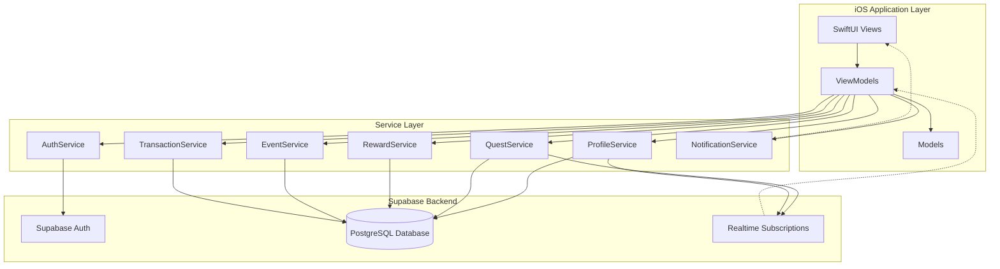
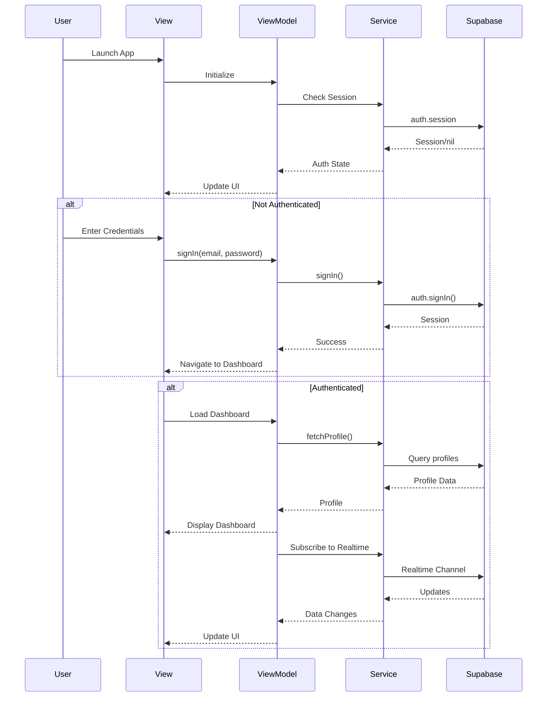

# Design Document: Couple Quest iOS Application

## Overview

Couple Quest is an iOS application designed for couples to track daily chores, celebrate special events, and earn points redeemable for rewards. The app uses a gamification approach to encourage collaboration and engagement between partners. Built with SwiftUI and MVVM architecture, it leverages Supabase for backend services including authentication, real-time database synchronization, and PostgreSQL storage. The application supports real-time updates, local notifications for upcoming events, and a shared point system that promotes teamwork and accountability.

The system architecture follows a clean separation of concerns with distinct layers: Views (SwiftUI), ViewModels (business logic), Models (data structures), and Services (Supabase integration). All network operations use Swift's modern async/await concurrency model for safe, efficient asynchronous programming.

## Architecture



## Main Application Flow



## Components and Interfaces

### Component 1: AuthService

**Purpose**: Manages user authentication, session state, and auth-related operations using Supabase Auth.

**Interface**:
```swift
@MainActor
class AuthService: ObservableObject {
    static let shared: AuthService
    @Published var session: Session?
    
    func signUp(email: String, password: String) async throws
    func signIn(email: String, password: String) async throws
    func signOut() async throws
    func resetPassword(email: String) async throws
}
```

**Responsibilities**:
- Maintain current authentication session state
- Handle user registration and login flows
- Manage session persistence across app launches
- Listen to auth state changes via Supabase auth stream
- Provide thread-safe session updates to UI layer

**Formal Specifications**:

**Preconditions**:
- Supabase client must be properly configured with valid URL and anon key
- Email must be valid format for signUp/signIn operations
- Password must meet minimum security requirements (6+ characters)

**Postconditions**:
- After successful signIn/signUp: session is non-nil and contains valid user data
- After signOut: session is nil
- All auth state changes are published to @Published session property
- Auth state changes trigger UI updates on main thread

**Invariants**:
- session property is always accessed on MainActor
- Only one active session exists at any time
- Session state is consistent with Supabase backend state

---

### Component 2: ProfileService

**Purpose**: Manages user profile data, partner pairing, and point balance operations.

**Interface**:
```swift
class ProfileService {
    func fetchProfile(userId: UUID) async throws -> Profile
    func createProfile(userId: UUID, displayName: String) async throws -> Profile
    func updateDisplayName(userId: UUID, newName: String) async throws
    func pairWithPartner(userId: UUID, partnerId: UUID) async throws
    func updatePoints(userId: UUID, delta: Int) async throws
    func subscribeToProfileChanges(userId: UUID, handler: @escaping (Profile) -> Void) async throws
}
```

**Responsibilities**:
- CRUD operations for user profiles
- Partner pairing logic and validation
- Point balance management with atomic updates
- Real-time profile synchronization between partners
- Ensure data consistency for shared profile data

**Formal Specifications**:

**Preconditions**:
- userId must exist in auth.users table
- For pairWithPartner: both userId and partnerId must be valid and not already paired
- For updatePoints: delta must not result in negative total_points

**Postconditions**:
- fetchProfile returns complete profile with current point balance
- pairWithPartner creates bidirectional relationship (both users reference each other)
- updatePoints atomically modifies total_points and creates transaction record
- subscribeToProfileChanges delivers real-time updates when profile data changes

**Invariants**:
- Partner relationships are always bidirectional (if A.partner_id = B, then B.partner_id = A)
- total_points is never negative
- Profile changes trigger realtime notifications to subscribed clients

---

### Component 3: QuestService

**Purpose**: Manages quest lifecycle including creation, completion, and real-time synchronization.

**Interface**:
```swift
class QuestService {
    func fetchActiveQuests() async throws -> [Quest]
    func createQuest(title: String, points: Int, createdBy: UUID, eventId: UUID?, expireAt: Date?) async throws -> Quest
    func completeQuest(questId: UUID, userId: UUID) async throws
    func deleteQuest(questId: UUID) async throws
    func subscribeToQuestChanges(handler: @escaping ([Quest]) -> Void) async throws
}
```

**Responsibilities**:
- Quest CRUD operations with validation
- Quest completion workflow with point awarding
- Automatic quest expiration handling
- Real-time quest board synchronization between partners
- Transaction logging for completed quests

**Formal Specifications**:

**Preconditions**:
- For createQuest: points must be positive integer, createdBy must be valid user
- For completeQuest: quest must exist and have status = 'pending'
- For completeQuest: userId must be valid profile with partner relationship

**Postconditions**:
- completeQuest atomically: updates quest.status to 'completed', adds points to user balance, creates transaction record
- Completed quests are excluded from fetchActiveQuests results
- Quest changes trigger realtime updates to all subscribed clients
- Expired quests (expire_at < now) are automatically filtered from active list

**Invariants**:
- Quest status is either 'pending' or 'completed'
- Completed quests cannot be completed again
- Point awards are always recorded in transactions table
- Real-time subscriptions deliver updates within 100ms

---

### Component 4: RewardService

**Purpose**: Manages reward catalog and redemption operations with point deduction.

**Interface**:
```swift
class RewardService {
    func fetchActiveRewards() async throws -> [Reward]
    func createReward(title: String, pointsCost: Int) async throws -> Reward
    func redeemReward(rewardId: UUID, userId: UUID) async throws
    func toggleRewardActive(rewardId: UUID, isActive: Bool) async throws
}
```

**Responsibilities**:
- Reward catalog management
- Redemption validation and processing
- Point deduction with transaction logging
- Ensure sufficient balance before redemption
- Atomic redemption operations

**Formal Specifications**:

**Preconditions**:
- For createReward: pointsCost must be positive integer
- For redeemReward: reward must exist and is_active = true
- For redeemReward: user must have total_points >= reward.points_cost

**Postconditions**:
- redeemReward atomically: deducts points from user balance, creates transaction record with type='redeem'
- fetchActiveRewards returns only rewards where is_active = true
- Failed redemptions (insufficient points) do not modify any data
- All redemptions are logged with timestamp and description

**Invariants**:
- Reward points_cost is always positive
- User balance never goes negative after redemption
- Each redemption creates exactly one transaction record
- Redemption operations are atomic (all-or-nothing)

---

### Component 5: EventService

**Purpose**: Manages special events, anniversaries, and countdown calculations.

**Interface**:
```swift
class EventService {
    func fetchUpcomingEvents() async throws -> [Event]
    func createEvent(title: String, eventDate: Date, isRecurring: Bool) async throws -> Event
    func updateEvent(eventId: UUID, title: String?, eventDate: Date?, isRecurring: Bool?) async throws
    func deleteEvent(eventId: UUID) async throws
    func calculateDaysUntil(event: Event) -> Int
}
```

**Responsibilities**:
- Event CRUD operations
- Upcoming event queries sorted by date
- Days-until-event calculations for UI display
- Support for recurring annual events
- Event-quest associations

**Formal Specifications**:

**Preconditions**:
- For createEvent: eventDate must be valid date
- For calculateDaysUntil: event.eventDate must be valid date

**Postconditions**:
- fetchUpcomingEvents returns events sorted by eventDate ascending
- calculateDaysUntil returns positive integer for future events, 0 for today, negative for past
- Recurring events automatically adjust to next occurrence year
- Event deletions cascade to associated quests (event_id set to null)

**Invariants**:
- Event dates are stored in UTC timezone
- Recurring events always show next occurrence relative to current date
- Event list is always sorted chronologically

---

### Component 6: TransactionService

**Purpose**: Provides transaction history and audit trail for point operations.

**Interface**:
```swift
class TransactionService {
    func fetchUserTransactions(userId: UUID, limit: Int?) async throws -> [Transaction]
    func fetchPartnerTransactions(userId: UUID, partnerId: UUID, limit: Int?) async throws -> [Transaction]
    func createTransaction(userId: UUID, type: TransactionType, amount: Int, description: String) async throws -> Transaction
}
```

**Responsibilities**:
- Transaction history queries with pagination
- Combined transaction view for both partners
- Transaction creation with validation
- Audit trail for all point changes
- Support for filtering by type (earn/redeem)

**Formal Specifications**:

**Preconditions**:
- userId must be valid profile
- For createTransaction: amount must be non-zero integer
- For createTransaction: type must be 'earn' or 'redeem'

**Postconditions**:
- fetchUserTransactions returns transactions sorted by created_at descending
- fetchPartnerTransactions returns combined history for both users
- All transactions include timestamp, type, amount, and description
- Transaction records are immutable once created

**Invariants**:
- Transactions are never deleted or modified
- created_at timestamp is automatically set to current time
- Transaction amount matches actual point change in profile
- Every point change has corresponding transaction record

---

### Component 7: NotificationService

**Purpose**: Manages local notifications for upcoming events and quest reminders.

**Interface**:
```swift
class NotificationService {
    func requestAuthorization() async throws -> Bool
    func scheduleEventReminder(event: Event, daysBeforeArray: [Int]) async throws
    func cancelEventReminder(eventId: UUID) async throws
    func cancelAllNotifications() async
    func getPendingNotifications() async -> [UNNotificationRequest]
}
```

**Responsibilities**:
- Request notification permissions from user
- Schedule local notifications for events (3 days and 1 day before)
- Cancel notifications when events are deleted
- Manage notification lifecycle
- Handle notification delivery and user interaction

**Formal Specifications**:

**Preconditions**:
- For scheduleEventReminder: notification authorization must be granted
- For scheduleEventReminder: event.eventDate must be in the future
- daysBeforeArray must contain positive integers

**Postconditions**:
- scheduleEventReminder creates notifications for each day in daysBeforeArray
- Notifications are delivered at 9:00 AM local time on scheduled days
- cancelEventReminder removes all notifications associated with eventId
- Notifications include event title and days remaining in message

**Invariants**:
- Maximum 64 pending notifications at any time (iOS limit)
- Notification identifiers are unique per event and days-before combination
- Past events do not generate notifications
- Notification scheduling is idempotent (can be called multiple times safely)


## Data Models

### Model 1: Profile

```swift
struct Profile: Identifiable, Codable {
    let id: UUID
    var displayName: String?
    var partnerId: UUID?
    var totalPoints: Int
    
    enum CodingKeys: String, CodingKey {
        case id
        case displayName = "display_name"
        case partnerId = "partner_id"
        case totalPoints = "total_points"
    }
}
```

**Validation Rules**:
- id must be valid UUID matching auth.users.id
- displayName is optional but recommended (max 50 characters)
- partnerId must reference existing profile or be nil
- totalPoints must be non-negative integer (>= 0)
- Partner relationship must be bidirectional when set

---

### Model 2: Event

```swift
struct Event: Identifiable, Codable {
    let id: UUID
    var title: String
    var eventDate: Date
    var isRecurring: Bool
    
    enum CodingKeys: String, CodingKey {
        case id
        case title
        case eventDate = "event_date"
        case isRecurring = "is_recurring"
    }
}
```

**Validation Rules**:
- id is auto-generated UUID
- title is required, non-empty string (max 100 characters)
- eventDate must be valid date (stored as Date, transmitted as ISO8601 string)
- isRecurring defaults to false
- Recurring events represent annual occurrences

---

### Model 3: Quest

```swift
enum QuestStatus: String, Codable {
    case pending
    case completed
}

struct Quest: Identifiable, Codable {
    let id: UUID
    var title: String
    var points: Int
    var status: QuestStatus
    var createdBy: UUID
    var eventId: UUID?
    var expireAt: Date?
    
    enum CodingKeys: String, CodingKey {
        case id
        case title
        case points
        case status
        case createdBy = "created_by"
        case eventId = "event_id"
        case expireAt = "expire_at"
    }
}
```

**Validation Rules**:
- id is auto-generated UUID
- title is required, non-empty string (max 200 characters)
- points must be positive integer (1-1000 range recommended)
- status defaults to 'pending', can only transition to 'completed'
- createdBy must reference valid profile
- eventId is optional, references associated event
- expireAt is optional, must be future date when set
- Expired quests (expireAt < now) are filtered from active list

---

### Model 4: Reward

```swift
struct Reward: Identifiable, Codable {
    let id: UUID
    var title: String
    var pointsCost: Int
    var isActive: Bool
    
    enum CodingKeys: String, CodingKey {
        case id
        case title
        case pointsCost = "points_cost"
        case isActive = "is_active"
    }
}
```

**Validation Rules**:
- id is auto-generated UUID
- title is required, non-empty string (max 100 characters)
- pointsCost must be positive integer (1-10000 range)
- isActive defaults to true
- Only active rewards appear in shop

---

### Model 5: Transaction

```swift
enum TransactionType: String, Codable {
    case earn
    case redeem
}

struct Transaction: Identifiable, Codable {
    let id: UUID
    let userId: UUID
    let type: TransactionType
    let amount: Int
    let description: String
    let createdAt: Date
    
    enum CodingKeys: String, CodingKey {
        case id
        case userId = "user_id"
        case type
        case amount
        case description
        case createdAt = "created_at"
    }
}
```

**Validation Rules**:
- id is auto-generated UUID
- userId must reference valid profile
- type must be 'earn' or 'redeem'
- amount must be non-zero integer (positive for earn, negative for redeem)
- description is required, non-empty string (max 200 characters)
- createdAt is auto-set to current timestamp
- Transactions are immutable once created


## Algorithmic Pseudocode

### Algorithm 1: Quest Completion Workflow

```swift
func completeQuest(questId: UUID, userId: UUID) async throws {
    // INPUT: questId (UUID), userId (UUID)
    // OUTPUT: Void (throws on error)
    // PRECONDITION: quest exists with status='pending', user has valid profile
    // POSTCONDITION: quest.status='completed', user points increased, transaction created
    
    // Step 1: Begin database transaction for atomicity
    try await supabase.database.transaction { db in
        
        // Step 2: Fetch and validate quest
        guard let quest = try await db.from("quests")
            .select()
            .eq("id", questId)
            .single()
            .execute()
            .value else {
            throw QuestError.notFound
        }
        
        // ASSERT: quest exists
        guard quest.status == .pending else {
            throw QuestError.alreadyCompleted
        }
        
        // Step 3: Update quest status
        try await db.from("quests")
            .update(["status": "completed"])
            .eq("id", questId)
            .execute()
        
        // Step 4: Update user points atomically
        try await db.rpc("increment_user_points", params: [
            "user_id": userId,
            "points_delta": quest.points
        ])
        
        // Step 5: Create transaction record
        let transaction = Transaction(
            id: UUID(),
            userId: userId,
            type: .earn,
            amount: quest.points,
            description: "Completed: \(quest.title)",
            createdAt: Date()
        )
        
        try await db.from("transactions")
            .insert(transaction)
            .execute()
        
        // ASSERT: All operations succeeded or transaction rolled back
    }
    
    // POSTCONDITION: Quest completed, points awarded, transaction logged
}
```

**Preconditions**:
- questId must reference existing quest in database
- userId must reference existing profile
- Quest status must be 'pending' (not already completed)
- Database connection must be active

**Postconditions**:
- Quest status updated to 'completed'
- User's total_points increased by quest.points
- Transaction record created with type='earn'
- All changes committed atomically or rolled back on error
- Realtime subscribers notified of quest and profile changes

**Loop Invariants**: N/A (no loops in this algorithm)

---

### Algorithm 2: Reward Redemption Workflow

```swift
func redeemReward(rewardId: UUID, userId: UUID) async throws {
    // INPUT: rewardId (UUID), userId (UUID)
    // OUTPUT: Void (throws on error)
    // PRECONDITION: reward exists and is_active=true, user has sufficient points
    // POSTCONDITION: user points decreased, transaction created
    
    // Step 1: Begin database transaction
    try await supabase.database.transaction { db in
        
        // Step 2: Fetch and validate reward
        guard let reward = try await db.from("rewards")
            .select()
            .eq("id", rewardId)
            .eq("is_active", true)
            .single()
            .execute()
            .value else {
            throw RewardError.notFoundOrInactive
        }
        
        // Step 3: Fetch user profile and check balance
        guard let profile = try await db.from("profiles")
            .select()
            .eq("id", userId)
            .single()
            .execute()
            .value else {
            throw ProfileError.notFound
        }
        
        // ASSERT: User has sufficient points
        guard profile.totalPoints >= reward.pointsCost else {
            throw RewardError.insufficientPoints(
                required: reward.pointsCost,
                available: profile.totalPoints
            )
        }
        
        // Step 4: Deduct points atomically
        try await db.rpc("increment_user_points", params: [
            "user_id": userId,
            "points_delta": -reward.pointsCost
        ])
        
        // Step 5: Create transaction record
        let transaction = Transaction(
            id: UUID(),
            userId: userId,
            type: .redeem,
            amount: -reward.pointsCost,
            description: "Redeemed: \(reward.title)",
            createdAt: Date()
        )
        
        try await db.from("transactions")
            .insert(transaction)
            .execute()
        
        // ASSERT: Points deducted and transaction logged
    }
    
    // POSTCONDITION: Reward redeemed, points deducted, transaction logged
}
```

**Preconditions**:
- rewardId must reference existing reward with is_active=true
- userId must reference existing profile
- User's total_points >= reward.points_cost
- Database connection must be active

**Postconditions**:
- User's total_points decreased by reward.points_cost
- Transaction record created with type='redeem' and negative amount
- User's total_points remains non-negative
- All changes committed atomically or rolled back on error
- Realtime subscribers notified of profile changes

**Loop Invariants**: N/A (no loops in this algorithm)

---

### Algorithm 3: Partner Pairing Workflow

```swift
func pairWithPartner(userId: UUID, partnerId: UUID) async throws {
    // INPUT: userId (UUID), partnerId (UUID)
    // OUTPUT: Void (throws on error)
    // PRECONDITION: both users exist, neither is already paired
    // POSTCONDITION: bidirectional partner relationship established
    
    // Step 1: Validate inputs
    guard userId != partnerId else {
        throw PairingError.cannotPairWithSelf
    }
    
    // Step 2: Begin database transaction
    try await supabase.database.transaction { db in
        
        // Step 3: Fetch both profiles
        let profiles = try await db.from("profiles")
            .select()
            .in("id", [userId, partnerId])
            .execute()
            .value
        
        guard profiles.count == 2 else {
            throw PairingError.userNotFound
        }
        
        let userProfile = profiles.first { $0.id == userId }!
        let partnerProfile = profiles.first { $0.id == partnerId }!
        
        // ASSERT: Both profiles exist
        guard userProfile.partnerId == nil else {
            throw PairingError.alreadyPaired(userId: userId)
        }
        
        guard partnerProfile.partnerId == nil else {
            throw PairingError.alreadyPaired(userId: partnerId)
        }
        
        // Step 4: Create bidirectional relationship
        try await db.from("profiles")
            .update(["partner_id": partnerId])
            .eq("id", userId)
            .execute()
        
        try await db.from("profiles")
            .update(["partner_id": userId])
            .eq("id", partnerId)
            .execute()
        
        // ASSERT: Both profiles now reference each other
    }
    
    // POSTCONDITION: userProfile.partnerId == partnerId AND partnerProfile.partnerId == userId
}
```

**Preconditions**:
- userId and partnerId must be different UUIDs
- Both users must exist in profiles table
- Neither user can have existing partner_id (must be nil)
- Database connection must be active

**Postconditions**:
- User profile updated with partner_id = partnerId
- Partner profile updated with partner_id = userId
- Relationship is bidirectional and consistent
- All changes committed atomically or rolled back on error
- Realtime subscribers notified of profile changes

**Loop Invariants**: N/A (no loops in this algorithm)

---

### Algorithm 4: Event Notification Scheduling

```swift
func scheduleEventReminder(event: Event, daysBeforeArray: [Int]) async throws {
    // INPUT: event (Event), daysBeforeArray ([Int])
    // OUTPUT: Void (throws on error)
    // PRECONDITION: notification authorization granted, event.eventDate is future date
    // POSTCONDITION: notifications scheduled for each day in daysBeforeArray
    
    // Step 1: Validate authorization
    let settings = await UNUserNotificationCenter.current().notificationSettings()
    guard settings.authorizationStatus == .authorized else {
        throw NotificationError.notAuthorized
    }
    
    // Step 2: Calculate notification dates
    let calendar = Calendar.current
    let now = Date()
    
    // ASSERT: event.eventDate > now
    guard event.eventDate > now else {
        throw NotificationError.eventInPast
    }
    
    // Step 3: Cancel existing notifications for this event
    let existingIdentifiers = daysBeforeArray.map { days in
        "event_\(event.id.uuidString)_\(days)days"
    }
    UNUserNotificationCenter.current().removePendingNotificationRequests(
        withIdentifiers: existingIdentifiers
    )
    
    // Step 4: Schedule new notifications
    // LOOP INVARIANT: All previously scheduled notifications are valid
    for daysBefore in daysBeforeArray {
        // Calculate trigger date (event date minus daysBefore at 9:00 AM)
        guard let notificationDate = calendar.date(
            byAdding: .day,
            value: -daysBefore,
            to: event.eventDate
        ) else {
            continue
        }
        
        // Skip if notification date is in the past
        guard notificationDate > now else {
            continue
        }
        
        // Create notification content
        let content = UNMutableNotificationContent()
        content.title = "Upcoming Event"
        content.body = "\(event.title) is in \(daysBefore) day\(daysBefore == 1 ? "" : "s")!"
        content.sound = .default
        content.categoryIdentifier = "EVENT_REMINDER"
        
        // Create trigger at 9:00 AM on notification date
        var dateComponents = calendar.dateComponents(
            [.year, .month, .day],
            from: notificationDate
        )
        dateComponents.hour = 9
        dateComponents.minute = 0
        
        let trigger = UNCalendarNotificationTrigger(
            dateMatching: dateComponents,
            repeats: false
        )
        
        // Create and schedule request
        let identifier = "event_\(event.id.uuidString)_\(daysBefore)days"
        let request = UNNotificationRequest(
            identifier: identifier,
            content: content,
            trigger: trigger
        )
        
        try await UNUserNotificationCenter.current().add(request)
        
        // ASSERT: Notification scheduled successfully
    }
    
    // POSTCONDITION: All valid notifications scheduled
}
```

**Preconditions**:
- Notification authorization status must be .authorized
- event.eventDate must be in the future (> Date())
- daysBeforeArray must contain positive integers
- UNUserNotificationCenter must be available

**Postconditions**:
- Notifications scheduled for each valid day in daysBeforeArray
- Each notification triggers at 9:00 AM local time on calculated date
- Past notification dates are skipped (not scheduled)
- Existing notifications for this event are replaced
- Notification identifiers follow pattern: "event_{eventId}_{days}days"

**Loop Invariants**:
- All previously scheduled notifications in the loop are valid and future-dated
- Each notification has unique identifier
- Notification content includes event title and days remaining
- Total pending notifications does not exceed iOS limit (64)


## Key Functions with Formal Specifications

### Function 1: fetchActiveQuests()

```swift
func fetchActiveQuests() async throws -> [Quest]
```

**Preconditions**:
- Supabase client must be initialized and connected
- User must be authenticated (valid session exists)

**Postconditions**:
- Returns array of Quest objects with status='pending'
- Expired quests (expireAt < now) are excluded from results
- Results are ordered by creation date (newest first)
- Empty array returned if no active quests exist
- Throws error if database connection fails

**Loop Invariants**: N/A (database query, no explicit loops)

---

### Function 2: updatePoints(userId:delta:)

```swift
func updatePoints(userId: UUID, delta: Int) async throws
```

**Preconditions**:
- userId must reference existing profile in database
- delta can be positive (earn) or negative (redeem)
- Resulting total_points must be non-negative (>= 0)

**Postconditions**:
- Profile's total_points updated by delta amount
- If delta would cause negative balance, throws error and no changes made
- Operation is atomic (uses database RPC function)
- Realtime subscribers notified of profile change
- No transaction record created (handled by calling function)

**Loop Invariants**: N/A (single atomic operation)

---

### Function 3: subscribeToQuestChanges(handler:)

```swift
func subscribeToQuestChanges(handler: @escaping ([Quest]) -> Void) async throws
```

**Preconditions**:
- Supabase client must be initialized with realtime enabled
- User must be authenticated
- Handler closure must be thread-safe for main actor calls

**Postconditions**:
- Establishes realtime subscription to 'quests' table
- Handler called immediately with current quest list
- Handler called whenever INSERT, UPDATE, or DELETE occurs on quests table
- Subscription remains active until explicitly cancelled or app terminates
- Handler receives complete updated quest list on each change

**Loop Invariants**: 
- Subscription maintains consistent connection to Supabase realtime
- Handler is called on main thread for UI safety
- Each notification contains complete, consistent quest state

---

### Function 4: calculateDaysUntil(event:)

```swift
func calculateDaysUntil(event: Event) -> Int
```

**Preconditions**:
- event.eventDate must be valid Date object
- Current date/time must be available from system

**Postconditions**:
- Returns positive integer for future events (days remaining)
- Returns 0 if event is today
- Returns negative integer for past events (days since)
- For recurring events, calculates to next occurrence (current or next year)
- Calculation uses calendar days, not 24-hour periods

**Loop Invariants**: N/A (pure calculation function)

---

### Function 5: requestAuthorization()

```swift
func requestAuthorization() async throws -> Bool
```

**Preconditions**:
- UNUserNotificationCenter must be available (iOS 10+)
- Function called from main thread or main actor context

**Postconditions**:
- Returns true if user grants notification permission
- Returns false if user denies permission
- Permission status persisted by iOS system
- Subsequent calls return cached permission status without prompting
- Throws error only on system-level failures

**Loop Invariants**: N/A (single system call)


## Example Usage

### Example 1: Complete Authentication Flow

```swift
// Initialize AuthService (singleton)
let authService = AuthService.shared

// Sign up new user
do {
    try await authService.signUp(
        email: "alice@example.com",
        password: "securePassword123"
    )
    print("Sign up successful, check email for confirmation")
} catch {
    print("Sign up failed: \(error.localizedDescription)")
}

// Sign in existing user
do {
    try await authService.signIn(
        email: "alice@example.com",
        password: "securePassword123"
    )
    print("Signed in successfully")
    print("User ID: \(authService.session?.user.id.uuidString ?? "")")
} catch {
    print("Sign in failed: \(error.localizedDescription)")
}

// Sign out
do {
    try await authService.signOut()
    print("Signed out successfully")
} catch {
    print("Sign out failed: \(error.localizedDescription)")
}
```

---

### Example 2: Partner Pairing Workflow

```swift
let profileService = ProfileService()

// User A creates profile after signup
let userAId = authService.session!.user.id
let profileA = try await profileService.createProfile(
    userId: userAId,
    displayName: "Alice"
)

// User B creates profile
let userBId = UUID() // Partner's user ID
let profileB = try await profileService.createProfile(
    userId: userBId,
    displayName: "Bob"
)

// User A initiates pairing with User B
do {
    try await profileService.pairWithPartner(
        userId: userAId,
        partnerId: userBId
    )
    print("Successfully paired with partner!")
    
    // Verify bidirectional relationship
    let updatedProfileA = try await profileService.fetchProfile(userId: userAId)
    let updatedProfileB = try await profileService.fetchProfile(userId: userBId)
    
    assert(updatedProfileA.partnerId == userBId)
    assert(updatedProfileB.partnerId == userAId)
    print("Bidirectional pairing confirmed")
} catch {
    print("Pairing failed: \(error.localizedDescription)")
}
```

---

### Example 3: Quest Creation and Completion

```swift
let questService = QuestService()
let userId = authService.session!.user.id

// Create a daily chore quest
let quest = try await questService.createQuest(
    title: "Do the dishes",
    points: 10,
    createdBy: userId,
    eventId: nil,
    expireAt: Calendar.current.date(byAdding: .day, value: 1, to: Date())
)
print("Quest created: \(quest.title) worth \(quest.points) points")

// Fetch active quests
let activeQuests = try await questService.fetchActiveQuests()
print("Active quests: \(activeQuests.count)")

// Complete the quest
do {
    try await questService.completeQuest(
        questId: quest.id,
        userId: userId
    )
    print("Quest completed! Earned \(quest.points) points")
    
    // Verify points were awarded
    let profile = try await profileService.fetchProfile(userId: userId)
    print("Current balance: \(profile.totalPoints) points")
} catch {
    print("Quest completion failed: \(error.localizedDescription)")
}
```

---

### Example 4: Reward Redemption

```swift
let rewardService = RewardService()
let userId = authService.session!.user.id

// Fetch available rewards
let rewards = try await rewardService.fetchActiveRewards()
print("Available rewards: \(rewards.count)")

for reward in rewards {
    print("- \(reward.title): \(reward.pointsCost) points")
}

// Redeem a reward
let selectedReward = rewards.first!
do {
    try await rewardService.redeemReward(
        rewardId: selectedReward.id,
        userId: userId
    )
    print("Redeemed: \(selectedReward.title)")
    
    // Verify points were deducted
    let profile = try await profileService.fetchProfile(userId: userId)
    print("Remaining balance: \(profile.totalPoints) points")
} catch RewardError.insufficientPoints(let required, let available) {
    print("Not enough points! Need \(required), have \(available)")
} catch {
    print("Redemption failed: \(error.localizedDescription)")
}
```

---

### Example 5: Real-time Quest Synchronization

```swift
let questService = QuestService()

// Subscribe to quest changes
Task {
    try await questService.subscribeToQuestChanges { updatedQuests in
        // This handler is called whenever quests change
        print("Quest board updated: \(updatedQuests.count) active quests")
        
        // Update UI on main thread
        await MainActor.run {
            self.quests = updatedQuests
        }
    }
}

// When partner completes a quest on their device,
// this device automatically receives the update
// and the handler above is called with the new quest list
```

---

### Example 6: Event Management with Notifications

```swift
let eventService = EventService()
let notificationService = NotificationService()

// Request notification permission
let authorized = try await notificationService.requestAuthorization()
guard authorized else {
    print("Notification permission denied")
    return
}

// Create anniversary event
let anniversary = try await eventService.createEvent(
    title: "Our Anniversary",
    eventDate: Calendar.current.date(from: DateComponents(year: 2025, month: 6, day: 15))!,
    isRecurring: true
)

// Schedule reminders (3 days and 1 day before)
try await notificationService.scheduleEventReminder(
    event: anniversary,
    daysBeforeArray: [3, 1]
)
print("Reminders scheduled for \(anniversary.title)")

// Calculate days until event
let daysUntil = eventService.calculateDaysUntil(event: anniversary)
if daysUntil > 0 {
    print("\(daysUntil) days until \(anniversary.title)")
} else if daysUntil == 0 {
    print("\(anniversary.title) is today!")
} else {
    print("\(anniversary.title) was \(abs(daysUntil)) days ago")
}
```

---

### Example 7: Transaction History

```swift
let transactionService = TransactionService()
let userId = authService.session!.user.id

// Fetch user's transaction history (last 20)
let transactions = try await transactionService.fetchUserTransactions(
    userId: userId,
    limit: 20
)

print("Transaction History:")
for transaction in transactions {
    let sign = transaction.type == .earn ? "+" : "-"
    print("\(transaction.createdAt): \(sign)\(abs(transaction.amount)) - \(transaction.description)")
}

// Fetch combined history for both partners
if let partnerId = profile.partnerId {
    let combinedHistory = try await transactionService.fetchPartnerTransactions(
        userId: userId,
        partnerId: partnerId,
        limit: 50
    )
    print("Combined partner history: \(combinedHistory.count) transactions")
}
```


## Correctness Properties

### Universal Quantification Statements

**Property 1: Point Balance Integrity**
```
∀ profile ∈ Profiles: profile.totalPoints ≥ 0
```
User point balances must never be negative. All point-modifying operations must validate this constraint before committing changes.

**Property 2: Bidirectional Partner Relationship**
```
∀ p1, p2 ∈ Profiles: (p1.partnerId = p2.id) ⟺ (p2.partnerId = p1.id)
```
Partner relationships are always bidirectional. If user A is paired with user B, then user B must be paired with user A.

**Property 3: Quest Completion Idempotency**
```
∀ quest ∈ Quests: quest.status = 'completed' ⟹ quest cannot be completed again
```
Once a quest is marked as completed, it cannot be completed again. Attempting to complete an already-completed quest must fail.

**Property 4: Transaction Immutability**
```
∀ transaction ∈ Transactions: transaction is immutable after creation
```
Transaction records are never modified or deleted after creation. They serve as an immutable audit trail.

**Property 5: Point Change Traceability**
```
∀ point change: ∃ transaction ∈ Transactions recording the change
```
Every change to a user's point balance must have a corresponding transaction record. No points can be added or removed without creating a transaction.

**Property 6: Atomic Quest Completion**
```
∀ quest completion: (quest.status updated ∧ points awarded ∧ transaction created) ∨ (no changes made)
```
Quest completion is atomic. Either all three operations succeed (status update, point award, transaction creation) or none of them do.

**Property 7: Atomic Reward Redemption**
```
∀ reward redemption: (points deducted ∧ transaction created) ∨ (no changes made)
```
Reward redemption is atomic. Either both operations succeed (point deduction, transaction creation) or neither does.

**Property 8: Sufficient Balance for Redemption**
```
∀ redemption: redemption succeeds ⟹ user.totalPoints ≥ reward.pointsCost (before redemption)
```
A reward can only be redeemed if the user has sufficient points. Redemptions that would result in negative balance must fail.

**Property 9: Active Quest Filtering**
```
∀ quest ∈ fetchActiveQuests(): quest.status = 'pending' ∧ (quest.expireAt = null ∨ quest.expireAt > now)
```
The active quest list only includes quests with pending status and no expiration, or expiration date in the future.

**Property 10: Realtime Consistency**
```
∀ data change in {quests, profiles}: all subscribed clients receive update within 100ms
```
When data changes in the database, all clients subscribed to realtime updates receive the change notification within 100 milliseconds.

**Property 11: Notification Scheduling Validity**
```
∀ notification ∈ scheduledNotifications: notification.triggerDate > now ∧ notification.triggerDate < event.eventDate
```
All scheduled notifications have trigger dates in the future and before the associated event date.

**Property 12: Partner Pairing Uniqueness**
```
∀ user ∈ Profiles: user.partnerId ≠ null ⟹ ∃! partner ∈ Profiles: partner.id = user.partnerId
```
If a user has a partner, that partner must exist and be unique. A user can have at most one partner.

**Property 13: Transaction Amount Consistency**
```
∀ transaction ∈ Transactions: 
  (transaction.type = 'earn' ⟹ transaction.amount > 0) ∧
  (transaction.type = 'redeem' ⟹ transaction.amount < 0)
```
Earn transactions have positive amounts, redeem transactions have negative amounts.

**Property 14: Event Date Validity**
```
∀ event ∈ Events: event.eventDate is valid date
```
All events must have valid, parseable dates. Invalid dates are rejected at creation time.

**Property 15: Quest Point Positivity**
```
∀ quest ∈ Quests: quest.points > 0
```
All quests must award positive points. Zero or negative point quests are invalid.


## Error Handling

### Error Scenario 1: Authentication Failure

**Condition**: User provides invalid credentials or network connection fails during authentication
**Response**: 
- Catch authentication errors from Supabase Auth
- Display user-friendly error message in UI alert
- Log error details for debugging
- Do not update session state

**Recovery**: 
- Allow user to retry with corrected credentials
- Provide "Forgot Password" flow for password reset
- Check network connectivity and prompt user if offline

**Error Types**:
```swift
enum AuthError: LocalizedError {
    case invalidCredentials
    case networkError
    case emailNotConfirmed
    case weakPassword
    
    var errorDescription: String? {
        switch self {
        case .invalidCredentials: return "Invalid email or password"
        case .networkError: return "Network connection failed"
        case .emailNotConfirmed: return "Please confirm your email"
        case .weakPassword: return "Password must be at least 6 characters"
        }
    }
}
```

---

### Error Scenario 2: Insufficient Points for Redemption

**Condition**: User attempts to redeem reward but has fewer points than required
**Response**:
- Check user balance before attempting redemption
- Throw `RewardError.insufficientPoints` with required and available amounts
- Display alert showing point deficit
- No database changes made

**Recovery**:
- Show user their current balance and points needed
- Suggest completing quests to earn more points
- Allow user to browse other rewards within their budget

**Error Types**:
```swift
enum RewardError: LocalizedError {
    case notFoundOrInactive
    case insufficientPoints(required: Int, available: Int)
    case redemptionFailed
    
    var errorDescription: String? {
        switch self {
        case .notFoundOrInactive:
            return "This reward is no longer available"
        case .insufficientPoints(let required, let available):
            return "Need \(required) points, you have \(available)"
        case .redemptionFailed:
            return "Redemption failed, please try again"
        }
    }
}
```

---

### Error Scenario 3: Quest Already Completed

**Condition**: User attempts to complete a quest that has already been marked as completed
**Response**:
- Check quest status before processing completion
- Throw `QuestError.alreadyCompleted`
- Display message indicating quest was already completed
- No points awarded, no database changes

**Recovery**:
- Refresh quest list to show current state
- Remove completed quest from active quest board
- Suggest other available quests

**Error Types**:
```swift
enum QuestError: LocalizedError {
    case notFound
    case alreadyCompleted
    case expired
    case creationFailed
    
    var errorDescription: String? {
        switch self {
        case .notFound: return "Quest not found"
        case .alreadyCompleted: return "Quest already completed"
        case .expired: return "Quest has expired"
        case .creationFailed: return "Failed to create quest"
        }
    }
}
```

---

### Error Scenario 4: Partner Already Paired

**Condition**: User attempts to pair with partner who is already paired with someone else
**Response**:
- Check both users' partner_id before pairing
- Throw `PairingError.alreadyPaired` with userId
- Display message indicating user is already paired
- No database changes made

**Recovery**:
- Inform user that partner is already paired
- Suggest partner unpair from current relationship first
- Provide option to cancel pairing request

**Error Types**:
```swift
enum PairingError: LocalizedError {
    case userNotFound
    case alreadyPaired(userId: UUID)
    case cannotPairWithSelf
    case pairingFailed
    
    var errorDescription: String? {
        switch self {
        case .userNotFound: return "User not found"
        case .alreadyPaired: return "User is already paired"
        case .cannotPairWithSelf: return "Cannot pair with yourself"
        case .pairingFailed: return "Pairing failed, please try again"
        }
    }
}
```

---

### Error Scenario 5: Realtime Subscription Failure

**Condition**: Realtime subscription fails to establish or disconnects unexpectedly
**Response**:
- Catch subscription errors from Supabase Realtime
- Log error details for debugging
- Display connection status indicator in UI
- Fall back to manual refresh

**Recovery**:
- Attempt automatic reconnection with exponential backoff
- Provide manual refresh button for user
- Show cached data while offline
- Notify user when connection is restored

**Error Types**:
```swift
enum RealtimeError: LocalizedError {
    case subscriptionFailed
    case connectionLost
    case channelError
    
    var errorDescription: String? {
        switch self {
        case .subscriptionFailed: return "Failed to connect to realtime updates"
        case .connectionLost: return "Connection lost, attempting to reconnect"
        case .channelError: return "Realtime channel error"
        }
    }
}
```

---

### Error Scenario 6: Notification Permission Denied

**Condition**: User denies notification permission or revokes it in system settings
**Response**:
- Check authorization status before scheduling notifications
- Return false from requestAuthorization()
- Display message explaining notification benefits
- Continue app functionality without notifications

**Recovery**:
- Provide in-app reminder system as fallback
- Show instructions to enable notifications in Settings
- Periodically check if permission status changes
- Gracefully degrade to non-notification experience

**Error Types**:
```swift
enum NotificationError: LocalizedError {
    case notAuthorized
    case schedulingFailed
    case eventInPast
    
    var errorDescription: String? {
        switch self {
        case .notAuthorized: return "Notification permission not granted"
        case .schedulingFailed: return "Failed to schedule notification"
        case .eventInPast: return "Cannot schedule notification for past event"
        }
    }
}
```

---

### Error Scenario 7: Database Transaction Rollback

**Condition**: Any operation within a database transaction fails, requiring rollback
**Response**:
- Supabase automatically rolls back all changes in transaction
- Catch transaction error and log details
- Display generic error message to user
- Ensure no partial state changes persist

**Recovery**:
- Allow user to retry the operation
- Check for transient issues (network, timeout)
- Verify data integrity before retry
- Log error for debugging and monitoring

**Error Types**:
```swift
enum DatabaseError: LocalizedError {
    case transactionFailed
    case queryFailed
    case connectionTimeout
    case constraintViolation
    
    var errorDescription: String? {
        switch self {
        case .transactionFailed: return "Operation failed, please try again"
        case .queryFailed: return "Database query failed"
        case .connectionTimeout: return "Connection timeout, check your network"
        case .constraintViolation: return "Data validation failed"
        }
    }
}
```


## Testing Strategy

### Unit Testing Approach

**Objective**: Test individual components, services, and business logic in isolation.

**Key Test Cases**:

1. **AuthService Tests**
   - Test successful sign up with valid credentials
   - Test sign in with correct credentials
   - Test sign in failure with incorrect credentials
   - Test sign out clears session state
   - Test session persistence across app launches
   - Test auth state change notifications

2. **ProfileService Tests**
   - Test profile creation with valid data
   - Test profile fetch returns correct data
   - Test partner pairing creates bidirectional relationship
   - Test pairing fails when user already paired
   - Test point update increases/decreases balance correctly
   - Test point update fails when result would be negative

3. **QuestService Tests**
   - Test quest creation with valid parameters
   - Test fetch active quests excludes completed and expired
   - Test quest completion updates status and awards points
   - Test quest completion fails for already completed quest
   - Test quest completion creates transaction record
   - Test expired quests are filtered from active list

4. **RewardService Tests**
   - Test reward redemption with sufficient balance
   - Test redemption fails with insufficient balance
   - Test redemption deducts correct point amount
   - Test redemption creates transaction record
   - Test fetch active rewards excludes inactive rewards

5. **EventService Tests**
   - Test event creation with valid date
   - Test calculateDaysUntil returns correct value for future events
   - Test calculateDaysUntil returns 0 for today
   - Test calculateDaysUntil returns negative for past events
   - Test recurring events show next occurrence

6. **NotificationService Tests**
   - Test authorization request returns correct status
   - Test notification scheduling for future events
   - Test notification scheduling skips past dates
   - Test notification cancellation removes pending notifications
   - Test notification identifiers are unique per event

**Coverage Goals**:
- Minimum 80% code coverage for service layer
- 100% coverage for critical paths (point transactions, quest completion, reward redemption)
- All error handling paths tested
- All edge cases covered (boundary values, null checks, empty collections)

**Testing Tools**:
- XCTest framework for unit tests
- Mock Supabase client for isolated testing
- XCTestExpectation for async/await testing
- Test doubles for dependencies

---

### Property-Based Testing Approach

**Objective**: Verify system properties hold for wide range of inputs using generative testing.

**Property Test Library**: swift-check (QuickCheck-style property testing for Swift)

**Key Properties to Test**:

1. **Point Balance Non-Negativity**
   ```swift
   property("Point balance never goes negative") {
       forAll { (initialPoints: UInt, operations: [PointOperation]) in
           var balance = Int(initialPoints)
           for op in operations {
               if op.isDeduction && op.amount > balance {
                   // Should fail gracefully
                   continue
               }
               balance += op.delta
           }
           return balance >= 0
       }
   }
   ```

2. **Partner Relationship Symmetry**
   ```swift
   property("Partner relationships are bidirectional") {
       forAll { (userA: UUID, userB: UUID) in
           guard userA != userB else { return true }
           
           try await pairWithPartner(userId: userA, partnerId: userB)
           
           let profileA = try await fetchProfile(userId: userA)
           let profileB = try await fetchProfile(userId: userB)
           
           return profileA.partnerId == userB && profileB.partnerId == userA
       }
   }
   ```

3. **Quest Completion Idempotency**
   ```swift
   property("Completing quest multiple times only awards points once") {
       forAll { (quest: Quest, userId: UUID, attempts: UInt) in
           let initialBalance = try await fetchProfile(userId: userId).totalPoints
           
           for _ in 0..<attempts {
               try? await completeQuest(questId: quest.id, userId: userId)
           }
           
           let finalBalance = try await fetchProfile(userId: userId).totalPoints
           return finalBalance == initialBalance + quest.points
       }
   }
   ```

4. **Transaction Sum Equals Balance**
   ```swift
   property("Sum of transactions equals current balance") {
       forAll { (userId: UUID) in
           let profile = try await fetchProfile(userId: userId)
           let transactions = try await fetchUserTransactions(userId: userId, limit: nil)
           
           let sum = transactions.reduce(0) { $0 + $1.amount }
           return sum == profile.totalPoints
       }
   }
   ```

5. **Atomic Operations**
   ```swift
   property("Failed operations leave no partial state") {
       forAll { (operation: DatabaseOperation) in
           let stateBefore = try await captureSystemState()
           
           do {
               try await operation.execute()
           } catch {
               let stateAfter = try await captureSystemState()
               return stateBefore == stateAfter
           }
           
           return true
       }
   }
   ```

**Property Test Configuration**:
- Run 100 test cases per property
- Use shrinking to find minimal failing examples
- Test with edge cases: empty collections, boundary values, null/nil
- Generate realistic test data matching domain constraints

---

### Integration Testing Approach

**Objective**: Test interactions between components and with Supabase backend.

**Key Integration Tests**:

1. **End-to-End Authentication Flow**
   - Sign up → Email confirmation → Sign in → Access protected resources
   - Test session persistence across app restarts
   - Test concurrent sessions on multiple devices

2. **Complete Quest Workflow**
   - Create quest → Subscribe to realtime → Complete quest → Verify points awarded → Check transaction created
   - Test realtime updates propagate to partner's device
   - Test concurrent quest completions

3. **Reward Redemption Flow**
   - Earn points through quests → Browse rewards → Redeem reward → Verify points deducted → Check transaction logged
   - Test insufficient balance handling
   - Test concurrent redemptions

4. **Partner Pairing and Synchronization**
   - User A pairs with User B → Verify bidirectional relationship → Test shared quest board → Test shared transaction history
   - Test realtime synchronization between partners
   - Test unpair and re-pair scenarios

5. **Event Notification Flow**
   - Create event → Request notification permission → Schedule notifications → Verify notifications delivered at correct time
   - Test notification cancellation when event deleted
   - Test recurring event notifications

6. **Database Transaction Integrity**
   - Test rollback on quest completion failure
   - Test rollback on reward redemption failure
   - Test concurrent operations maintain consistency

**Integration Test Environment**:
- Use local Supabase instance for testing (Docker)
- Reset database state between tests
- Test with realistic network conditions (latency, timeouts)
- Test offline scenarios and reconnection

**Test Data Management**:
- Use test fixtures for consistent data
- Clean up test data after each test
- Use separate test database from development
- Seed database with realistic test scenarios


## Performance Considerations

### Database Query Optimization

**Challenge**: Minimize database round trips and query execution time for responsive UI.

**Strategies**:
- Use database indexes on frequently queried columns (user_id, partner_id, status, event_date)
- Implement pagination for transaction history (limit queries to 20-50 records)
- Use Supabase RPC functions for complex operations (atomic point updates)
- Cache profile data locally to reduce repeated fetches
- Batch related queries using Supabase's query builder

**Performance Targets**:
- Profile fetch: < 100ms
- Quest list fetch: < 150ms
- Quest completion: < 200ms (includes transaction)
- Reward redemption: < 200ms (includes transaction)
- Realtime update propagation: < 100ms

---

### Realtime Subscription Management

**Challenge**: Maintain efficient realtime connections without excessive battery or network usage.

**Strategies**:
- Subscribe only to relevant channels (user's own data and partner's data)
- Unsubscribe from channels when views are dismissed
- Use single shared subscription per data type (avoid duplicate subscriptions)
- Implement connection pooling and reuse
- Handle reconnection with exponential backoff

**Best Practices**:
- Limit active subscriptions to 3-5 channels maximum
- Debounce rapid updates to prevent UI thrashing
- Use background refresh for non-critical updates
- Monitor connection state and adapt behavior

---

### Local Caching Strategy

**Challenge**: Reduce network requests and improve perceived performance.

**Strategies**:
- Cache profile data in memory (UserDefaults for persistence)
- Cache quest list with 30-second TTL (time-to-live)
- Cache reward catalog with 5-minute TTL
- Use optimistic UI updates (update UI immediately, sync in background)
- Implement cache invalidation on realtime updates

**Cache Hierarchy**:
1. Memory cache (fastest, volatile)
2. UserDefaults (persistent, small data)
3. File system (persistent, larger data)
4. Network (slowest, always fresh)

---

### Image and Asset Optimization

**Challenge**: Minimize app size and memory usage for images and assets.

**Strategies**:
- Use SF Symbols for icons (system-provided, scalable)
- Compress custom images using asset catalog compression
- Use vector graphics (PDF) for scalable assets
- Lazy load images only when needed
- Implement image caching for user avatars (if added)

---

### Memory Management

**Challenge**: Prevent memory leaks and excessive memory usage.

**Strategies**:
- Use weak references in closures to prevent retain cycles
- Properly cancel async tasks when views are dismissed
- Unsubscribe from realtime channels in deinit
- Use @MainActor for UI-related classes to prevent threading issues
- Monitor memory usage in Instruments

**Critical Areas**:
- Realtime subscription handlers (use [weak self])
- ViewModel observation (use @StateObject, not @ObservedObject in wrong places)
- Async task lifecycle management
- Large data collections (implement pagination)

---

### Network Efficiency

**Challenge**: Minimize data transfer and network requests.

**Strategies**:
- Use Supabase's select() to fetch only needed columns
- Implement request deduplication (avoid duplicate concurrent requests)
- Use HTTP/2 multiplexing (Supabase default)
- Compress request/response payloads
- Implement offline queue for operations when network unavailable

**Network Optimization Targets**:
- Average request size: < 5KB
- Average response size: < 10KB
- Concurrent requests: < 3 at a time
- Request timeout: 10 seconds

---

### UI Responsiveness

**Challenge**: Maintain 60 FPS scrolling and smooth animations.

**Strategies**:
- Perform all network operations off main thread (async/await handles this)
- Use LazyVStack/LazyHStack for long lists
- Implement pull-to-refresh with haptic feedback
- Show loading indicators for operations > 200ms
- Use skeleton screens for initial loads

**UI Performance Targets**:
- App launch time: < 2 seconds
- View transition time: < 300ms
- List scrolling: 60 FPS
- Animation frame rate: 60 FPS


## Security Considerations

### Authentication Security

**Threats**:
- Credential theft through man-in-the-middle attacks
- Brute force password attacks
- Session hijacking
- Unauthorized access to user data

**Mitigations**:
- Use HTTPS for all network communication (Supabase enforces this)
- Implement secure password requirements (minimum 6 characters, recommend 12+)
- Use Supabase Auth's built-in session management (JWT tokens)
- Store session tokens securely in iOS Keychain (Supabase SDK handles this)
- Implement automatic session expiration and refresh
- Never log or display sensitive credentials
- Use email confirmation for new accounts

**Best Practices**:
- Encourage strong passwords with password strength indicator
- Implement rate limiting on authentication attempts (Supabase provides this)
- Support password reset flow via email
- Consider adding biometric authentication (Face ID/Touch ID) for convenience
- Clear session data on sign out

---

### Data Access Control

**Threats**:
- Unauthorized access to other users' data
- Partner accessing data after unpairing
- Malicious data modification
- SQL injection attacks

**Mitigations**:
- Implement Row Level Security (RLS) policies in Supabase:
  ```sql
  -- Users can only read their own profile and their partner's profile
  CREATE POLICY "Users can view own and partner profile"
  ON profiles FOR SELECT
  USING (
    auth.uid() = id OR 
    auth.uid() = partner_id
  );
  
  -- Users can only update their own profile
  CREATE POLICY "Users can update own profile"
  ON profiles FOR UPDATE
  USING (auth.uid() = id);
  
  -- Users can view quests created by themselves or their partner
  CREATE POLICY "Users can view shared quests"
  ON quests FOR SELECT
  USING (
    auth.uid() = created_by OR
    auth.uid() IN (
      SELECT partner_id FROM profiles WHERE id = created_by
    )
  );
  
  -- Users can only complete quests (not delete or modify)
  CREATE POLICY "Users can complete quests"
  ON quests FOR UPDATE
  USING (
    status = 'pending' AND
    (auth.uid() = created_by OR
     auth.uid() IN (SELECT partner_id FROM profiles WHERE id = created_by))
  );
  
  -- Users can only view their own transactions
  CREATE POLICY "Users can view own transactions"
  ON transactions FOR SELECT
  USING (auth.uid() = user_id);
  ```

- Use parameterized queries (Supabase SDK prevents SQL injection)
- Validate all user inputs on client and server side
- Implement proper authorization checks before operations
- Use database constraints to enforce data integrity

---

### Point System Integrity

**Threats**:
- Point manipulation through client-side tampering
- Race conditions in concurrent point updates
- Unauthorized point transfers
- Negative balance exploitation

**Mitigations**:
- Perform all point calculations on server side (use Supabase RPC functions)
- Use database transactions for atomic point updates
- Implement database constraints (CHECK total_points >= 0)
- Create immutable transaction audit trail
- Validate point amounts before operations
- Use database-level functions for point updates:
  ```sql
  CREATE OR REPLACE FUNCTION increment_user_points(
    user_id UUID,
    points_delta INTEGER
  ) RETURNS void AS $$
  BEGIN
    UPDATE profiles
    SET total_points = total_points + points_delta
    WHERE id = user_id
    AND total_points + points_delta >= 0;
    
    IF NOT FOUND THEN
      RAISE EXCEPTION 'Insufficient points or user not found';
    END IF;
  END;
  $$ LANGUAGE plpgsql SECURITY DEFINER;
  ```

---

### API Key Protection

**Threats**:
- Exposure of Supabase anon key in source code
- API key extraction from compiled app
- Unauthorized API access

**Mitigations**:
- Use Supabase anon key (public key) in client app (this is safe)
- Never include service role key in client app
- Rely on RLS policies for data protection (not API key secrecy)
- Implement rate limiting on Supabase project
- Monitor API usage for anomalies
- Use environment-specific keys (development vs production)

**Note**: Supabase anon key is designed to be public. Security comes from RLS policies, not key secrecy.

---

### Data Privacy

**Threats**:
- Unauthorized access to personal information
- Data leakage through logs or analytics
- Insufficient data encryption
- Privacy violations in shared data

**Mitigations**:
- Minimize collection of personal data (only email and display name)
- Encrypt data in transit (HTTPS) and at rest (Supabase default)
- Implement data retention policies
- Provide user data export functionality
- Provide account deletion functionality
- Never log sensitive user data
- Comply with privacy regulations (GDPR, CCPA)
- Implement partner consent for data sharing

---

### Notification Security

**Threats**:
- Notification spoofing
- Sensitive data in notification content
- Unauthorized notification access

**Mitigations**:
- Use local notifications only (no push notifications initially)
- Avoid including sensitive data in notification content
- Use notification categories for proper handling
- Implement notification authentication if adding push notifications
- Respect user notification preferences

---

### Input Validation

**Threats**:
- Malicious input causing crashes or unexpected behavior
- XSS attacks through user-generated content
- Buffer overflow attacks
- Format string vulnerabilities

**Mitigations**:
- Validate all user inputs on client side
- Sanitize user-generated content (quest titles, reward titles, display names)
- Implement length limits on text fields
- Use type-safe Swift APIs (prevents many common vulnerabilities)
- Validate data types and formats before database operations
- Use prepared statements (Supabase SDK handles this)

**Validation Rules**:
- Email: Valid email format, max 255 characters
- Password: Min 6 characters (recommend 12+), max 72 characters
- Display name: Max 50 characters, alphanumeric + spaces
- Quest title: Max 200 characters, no HTML/scripts
- Reward title: Max 100 characters, no HTML/scripts
- Points: Positive integers, max 10000 per operation


## Dependencies

### Core Dependencies

**1. Supabase Swift SDK**
- **Package**: `supabase-swift`
- **Version**: Latest stable (2.x)
- **Purpose**: Backend integration, authentication, database, realtime
- **Installation**: Swift Package Manager
- **Repository**: https://github.com/supabase/supabase-swift
- **Sub-dependencies**: 
  - `postgrest-swift` (database queries)
  - `gotrue-swift` (authentication)
  - `realtime-swift` (realtime subscriptions)
  - `storage-swift` (file storage, if needed later)

**2. SwiftUI**
- **Framework**: Built-in iOS framework
- **Version**: iOS 16.0+
- **Purpose**: User interface and declarative UI
- **No installation required**: Part of iOS SDK

**3. Foundation**
- **Framework**: Built-in iOS framework
- **Purpose**: Core data types, networking, date/time handling
- **No installation required**: Part of iOS SDK

**4. Combine**
- **Framework**: Built-in iOS framework
- **Version**: iOS 13.0+
- **Purpose**: Reactive programming, @Published properties
- **No installation required**: Part of iOS SDK

**5. UserNotifications**
- **Framework**: Built-in iOS framework
- **Version**: iOS 10.0+
- **Purpose**: Local notification scheduling and management
- **No installation required**: Part of iOS SDK

---

### Development Dependencies

**1. XCTest**
- **Framework**: Built-in Xcode framework
- **Purpose**: Unit testing and integration testing
- **No installation required**: Part of Xcode

**2. swift-check (Optional)**
- **Package**: `swift-check`
- **Version**: Latest stable
- **Purpose**: Property-based testing
- **Installation**: Swift Package Manager
- **Repository**: https://github.com/typelift/SwiftCheck

---

### Backend Dependencies (Supabase)

**1. PostgreSQL**
- **Version**: 15.x (managed by Supabase)
- **Purpose**: Primary database
- **Managed by**: Supabase Cloud or self-hosted

**2. PostgREST**
- **Version**: Latest (managed by Supabase)
- **Purpose**: RESTful API for PostgreSQL
- **Managed by**: Supabase

**3. GoTrue**
- **Version**: Latest (managed by Supabase)
- **Purpose**: Authentication service
- **Managed by**: Supabase

**4. Realtime**
- **Version**: Latest (managed by Supabase)
- **Purpose**: WebSocket-based realtime subscriptions
- **Managed by**: Supabase

---

### Development Tools

**1. Xcode**
- **Version**: 15.0+ (for iOS 16+ support)
- **Purpose**: IDE, compiler, debugger, Interface Builder
- **Platform**: macOS only

**2. Swift**
- **Version**: 5.9+
- **Purpose**: Programming language
- **Included with**: Xcode

**3. Swift Package Manager**
- **Version**: Built-in with Swift
- **Purpose**: Dependency management
- **Included with**: Xcode

**4. Supabase CLI (Optional)**
- **Version**: Latest
- **Purpose**: Local development, migrations, database management
- **Installation**: npm install -g supabase
- **Repository**: https://github.com/supabase/cli

**5. Git**
- **Version**: 2.x+
- **Purpose**: Version control
- **Installation**: Included with Xcode Command Line Tools

---

### Optional Future Dependencies

**1. Kingfisher (Image Loading)**
- **Purpose**: Efficient image downloading and caching
- **Use case**: If adding user avatars or reward images
- **Repository**: https://github.com/onevcat/Kingfisher

**2. SwiftLint (Code Quality)**
- **Purpose**: Enforce Swift style and conventions
- **Use case**: Maintain code quality in team environment
- **Repository**: https://github.com/realm/SwiftLint

**3. Firebase Analytics (Optional)**
- **Purpose**: User behavior tracking and analytics
- **Use case**: If adding analytics for product insights
- **Note**: Alternative to Supabase Analytics

---

### System Requirements

**iOS Application**:
- iOS 16.0 or later
- iPhone only (iPad support can be added later)
- Network connection required for backend operations
- Notification permission (optional, for event reminders)

**Development Environment**:
- macOS 13.0 (Ventura) or later
- Xcode 15.0 or later
- 8GB RAM minimum (16GB recommended)
- 20GB free disk space

**Backend (Supabase)**:
- Supabase Cloud account (free tier available)
- OR self-hosted Supabase instance (Docker required)
- PostgreSQL 15.x
- Node.js 18+ (for Supabase CLI)

---

### Dependency Management Strategy

**Version Pinning**:
- Pin major versions in Package.swift to prevent breaking changes
- Use semantic versioning for dependency updates
- Test thoroughly before updating major versions

**Security Updates**:
- Monitor dependency security advisories
- Update dependencies promptly for security patches
- Use Xcode's dependency vulnerability scanning

**Dependency Audit**:
- Regularly review and audit dependencies
- Remove unused dependencies
- Prefer well-maintained, popular packages
- Minimize total dependency count

**Package.swift Example**:
```swift
// swift-tools-version: 5.9
import PackageDescription

let package = Package(
    name: "CoupleQuest",
    platforms: [
        .iOS(.v16)
    ],
    dependencies: [
        .package(
            url: "https://github.com/supabase/supabase-swift.git",
            from: "2.0.0"
        ),
        .package(
            url: "https://github.com/typelift/SwiftCheck.git",
            from: "0.12.0"
        )
    ],
    targets: [
        .target(
            name: "CoupleQuest",
            dependencies: [
                .product(name: "Supabase", package: "supabase-swift")
            ]
        ),
        .testTarget(
            name: "CoupleQuestTests",
            dependencies: [
                "CoupleQuest",
                .product(name: "SwiftCheck", package: "SwiftCheck")
            ]
        )
    ]
)
```


## Development Phases

### Phase 1: Foundation & Authentication (Week 1)

**Objectives**:
- Set up project structure and dependencies
- Implement authentication system
- Create basic navigation structure

**Tasks**:
1. Initialize Xcode project with SwiftUI and MVVM structure
2. Add Supabase Swift SDK via Swift Package Manager
3. Configure Supabase client with URL and anon key
4. Implement AuthService with sign up, sign in, sign out
5. Create authentication views (LoginView, SignUpView)
6. Implement session state management with @Published
7. Add basic error handling for auth operations
8. Create main navigation structure (authenticated vs unauthenticated)

**Deliverables**:
- Working authentication flow
- Session persistence across app launches
- Basic UI for login and signup
- AuthService with unit tests

**Success Criteria**:
- Users can sign up with email/password
- Users can sign in and session persists
- Users can sign out successfully
- Auth state changes update UI automatically

---

### Phase 2: Profile & Partner Pairing (Week 2)

**Objectives**:
- Implement profile management
- Create partner pairing system
- Set up database RLS policies

**Tasks**:
1. Create Profile model and ProfileService
2. Implement profile creation after signup
3. Build ProfileView for displaying user info
4. Create partner pairing UI (enter partner ID)
5. Implement bidirectional pairing logic
6. Add profile update functionality (display name)
7. Set up Row Level Security policies in Supabase
8. Add profile-related error handling
9. Implement profile data caching

**Deliverables**:
- Profile creation and management
- Partner pairing functionality
- ProfileView UI
- Database RLS policies configured
- ProfileService with unit tests

**Success Criteria**:
- Users can create and update profiles
- Users can pair with partners using partner ID
- Partner relationships are bidirectional
- RLS policies prevent unauthorized data access

---

### Phase 3: Quest System (Week 3)

**Objectives**:
- Implement quest creation and management
- Build quest completion workflow
- Set up realtime synchronization

**Tasks**:
1. Create Quest model and QuestService
2. Implement quest creation with validation
3. Build QuestBoardView to display active quests
4. Create QuestRowView component
5. Implement quest completion logic with point awarding
6. Add transaction logging for quest completions
7. Set up realtime subscription for quest changes
8. Implement quest expiration filtering
9. Add quest-related error handling
10. Create QuestViewModel for business logic

**Deliverables**:
- Quest creation and completion functionality
- Real-time quest board synchronization
- QuestBoardView UI
- Transaction logging system
- QuestService with unit tests

**Success Criteria**:
- Users can create quests with points and expiration
- Users can complete quests and earn points
- Quest completions update both partners' views in realtime
- Points are awarded atomically with transaction logging
- Expired quests are automatically filtered

---

### Phase 4: Reward System (Week 4)

**Objectives**:
- Implement reward catalog and redemption
- Build reward shop UI
- Add transaction history view

**Tasks**:
1. Create Reward model and RewardService
2. Implement reward creation and management
3. Build RewardShopView to display available rewards
4. Create RewardRowView component
5. Implement reward redemption logic with point deduction
6. Add balance validation before redemption
7. Create TransactionService for history queries
8. Build TransactionHistoryView
9. Add reward-related error handling
10. Implement optimistic UI updates for redemptions

**Deliverables**:
- Reward catalog and redemption functionality
- RewardShopView UI
- Transaction history view
- RewardService and TransactionService with unit tests

**Success Criteria**:
- Users can browse available rewards
- Users can redeem rewards with sufficient points
- Redemptions deduct points atomically
- Transaction history shows all point changes
- Insufficient balance prevents redemption

---

### Phase 5: Events & Notifications (Week 5)

**Objectives**:
- Implement event management
- Add local notification system
- Create event countdown widget

**Tasks**:
1. Create Event model and EventService
2. Implement event creation with date picker
3. Build EventListView to display upcoming events
4. Create EventRowView component
5. Implement NotificationService for local notifications
6. Request notification permissions
7. Schedule notifications for events (3 days and 1 day before)
8. Add event countdown calculation
9. Create anniversary/event widget for dashboard
10. Implement recurring event logic

**Deliverables**:
- Event creation and management
- Local notification system
- Event countdown widget
- EventService and NotificationService with unit tests

**Success Criteria**:
- Users can create events with dates
- Notifications scheduled automatically for events
- Countdown widget shows days until next event
- Recurring events show next occurrence
- Notifications delivered at correct times

---

### Phase 6: Dashboard & Polish (Week 6)

**Objectives**:
- Create unified dashboard view
- Implement UI polish and animations
- Add comprehensive error handling

**Tasks**:
1. Build DashboardView with all components
2. Display point balances for both partners
3. Add event countdown widget to dashboard
4. Show recent quests and rewards
5. Implement pull-to-refresh functionality
6. Add loading states and skeleton screens
7. Implement smooth animations and transitions
8. Add haptic feedback for interactions
9. Create comprehensive error alert system
10. Implement offline mode indicators

**Deliverables**:
- Unified dashboard view
- Polished UI with animations
- Comprehensive error handling
- Loading and empty states

**Success Criteria**:
- Dashboard shows all key information at a glance
- UI feels smooth and responsive (60 FPS)
- Errors are handled gracefully with user-friendly messages
- App works offline with cached data
- Pull-to-refresh updates all data

---

### Phase 7: Testing & Optimization (Week 7)

**Objectives**:
- Comprehensive testing coverage
- Performance optimization
- Security audit

**Tasks**:
1. Write unit tests for all services (80% coverage)
2. Implement property-based tests for critical properties
3. Create integration tests for end-to-end flows
4. Perform performance profiling with Instruments
5. Optimize database queries and indexes
6. Implement caching strategy
7. Conduct security audit of RLS policies
8. Test realtime synchronization under load
9. Test notification delivery reliability
10. Fix bugs and edge cases discovered during testing

**Deliverables**:
- Comprehensive test suite (unit, property, integration)
- Performance optimization report
- Security audit report
- Bug fixes and improvements

**Success Criteria**:
- 80%+ code coverage for service layer
- All critical properties verified with property tests
- Performance targets met (< 200ms for operations)
- No security vulnerabilities found
- All edge cases handled gracefully

---

### Phase 8: Deployment & Documentation (Week 8)

**Objectives**:
- Prepare for App Store submission
- Create user documentation
- Set up production environment

**Tasks**:
1. Configure production Supabase project
2. Set up app icons and launch screen
3. Create App Store screenshots and description
4. Write privacy policy and terms of service
5. Configure App Store Connect
6. Submit app for TestFlight beta testing
7. Create user guide and FAQ
8. Write developer documentation
9. Set up analytics and monitoring
10. Submit app for App Store review

**Deliverables**:
- Production-ready app
- App Store listing
- User documentation
- Developer documentation
- Beta testing program

**Success Criteria**:
- App passes App Store review guidelines
- Beta testers can install and use app
- Documentation is clear and comprehensive
- Production environment is stable and monitored
- App is ready for public release

---

## Timeline Summary

| Phase | Duration | Key Deliverables |
|-------|----------|------------------|
| Phase 1: Foundation & Authentication | Week 1 | Auth system, basic navigation |
| Phase 2: Profile & Partner Pairing | Week 2 | Profile management, pairing system |
| Phase 3: Quest System | Week 3 | Quest board, realtime sync |
| Phase 4: Reward System | Week 4 | Reward shop, transaction history |
| Phase 5: Events & Notifications | Week 5 | Event management, notifications |
| Phase 6: Dashboard & Polish | Week 6 | Unified dashboard, UI polish |
| Phase 7: Testing & Optimization | Week 7 | Testing, performance, security |
| Phase 8: Deployment & Documentation | Week 8 | App Store submission, docs |

**Total Duration**: 8 weeks (2 months)

**Note**: Timeline assumes single developer working full-time. Adjust based on team size and availability.

