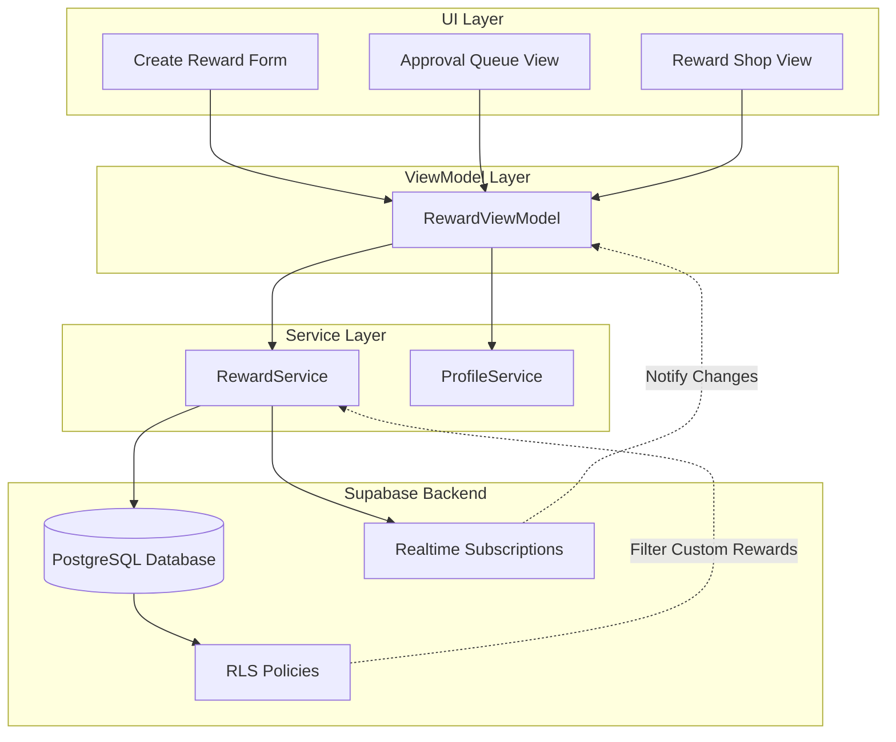
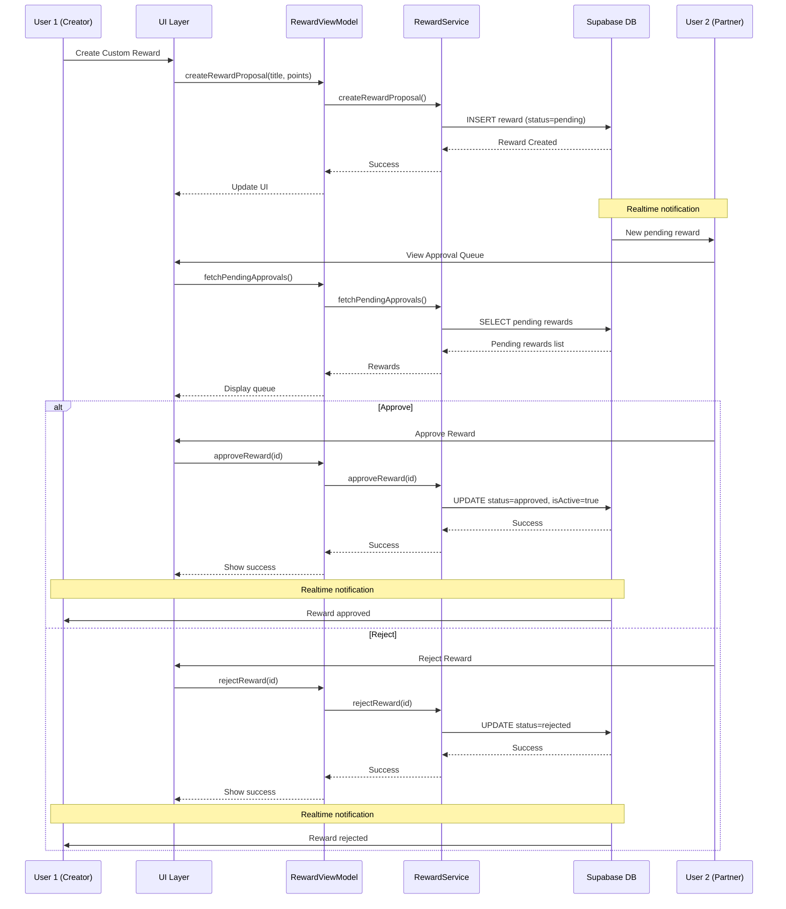

# Design Document: Partner-Approved Rewards

## Overview

The Partner-Approved Rewards feature extends the existing Couple Quest reward system to support user-generated custom rewards that require partner approval before becoming active. This feature maintains the collaborative spirit of the application by ensuring both partners agree on rewards before they become redeemable, while preserving the privacy of custom rewards within each couple's relationship.

The feature introduces a three-state workflow for custom rewards (pending, approved, rejected) and implements Row Level Security (RLS) policies to ensure custom rewards are only visible to the couple who created them. System-defined rewards remain globally visible and bypass the approval workflow. The implementation follows the existing MVVM architecture pattern with SwiftUI views, ViewModels for business logic, and a service layer for Supabase integration.

Key design principles:

- **Couple Collaboration**: Both partners must agree on custom rewards through an approval workflow
- **Privacy by Default**: Custom rewards are only visible to the creating couple
- **Atomic Operations**: Approval and rejection operations are atomic to prevent race conditions
- **Backward Compatibility**: Existing system rewards continue to work without modification
- **Consistent Architecture**: Follows established patterns from AuthService, ProfileService, and other existing services

## Architecture



## Reward Approval Workflow



## Components and Interfaces

### Component 1: RewardService (Extended)

**Purpose**: Manages reward lifecycle including custom reward creation, approval workflow, and privacy-filtered retrieval.

**Interface**:

```swift
class RewardService {
    // Existing methods
    func fetchActiveRewards() async throws -> [Reward]
    func redeemReward(rewardId: UUID, userId: UUID) async throws

    // New methods for custom rewards
    func createRewardProposal(title: String, pointsCost: Int, createdBy: UUID) async throws -> Reward
    func fetchPendingApprovals(userId: UUID) async throws -> [Reward]
    func approveReward(rewardId: UUID, approvingUserId: UUID) async throws
    func rejectReward(rewardId: UUID, rejectingUserId: UUID) async throws
    func subscribeToRewardChanges(handler: @escaping ([Reward]) -> Void) async throws
}
```

**Responsibilities**:

- Create custom reward proposals with status "pending"
- Fetch pending rewards requiring partner approval
- Execute approval operations with partner validation
- Execute rejection operations with partner validation
- Filter rewards based on RLS policies (custom vs system)
- Provide realtime updates for reward changes
- Validate reward data before database operations

**Formal Specifications**:

**Preconditions**:

- For createRewardProposal: title must be non-empty (1-100 chars), pointsCost must be positive (1-10000)
- For fetchPendingApprovals: userId must have valid profile with partnerId set
- For approveReward: approvingUserId must be partner of reward creator
- For rejectReward: rejectingUserId must be partner of reward creator

**Postconditions**:

- createRewardProposal: Returns reward with status="pending", isSystemReward=false, isActive=false
- fetchPendingApprovals: Returns only rewards where creator's partnerId equals userId
- approveReward: Atomically updates status="approved" and isActive=true
- rejectReward: Updates status="rejected", reward excluded from all queries
- All operations trigger realtime notifications to subscribed clients

**Invariants**:

- Custom rewards (isSystemReward=false) are only visible to creator and partner
- System rewards (isSystemReward=true) are visible to all users
- Only pending rewards can be approved or rejected
- Approved rewards have isActive=true
- Rejected and pending rewards have isActive=false

---

### Component 2: RewardViewModel (Extended)

**Purpose**: Manages UI state and coordinates reward operations between views and services.

**Interface**:

```swift
@MainActor
class RewardViewModel: ObservableObject {
    // Existing properties
    @Published var activeRewards: [Reward] = []
    @Published var isLoading: Bool = false
    @Published var errorMessage: String?

    // New properties for custom rewards
    @Published var pendingApprovals: [Reward] = []
    @Published var showSuccessMessage: Bool = false
    @Published var successMessage: String = ""

    // Existing methods
    func loadActiveRewards() async
    func redeemReward(_ reward: Reward) async

    // New methods
    func createRewardProposal(title: String, pointsCost: Int) async
    func loadPendingApprovals() async
    func approveReward(_ reward: Reward) async
    func rejectReward(_ reward: Reward) async
}
```

**Responsibilities**:

- Maintain UI state for reward lists and approval queue
- Validate user input before calling service methods
- Handle loading states and error messages
- Coordinate between RewardService and ProfileService
- Provide user feedback for success/failure operations
- Subscribe to realtime reward updates

**Formal Specifications**:

**Preconditions**:

- User must be authenticated (AuthService.shared.session != nil)
- For approval/rejection: User must have partner relationship

**Postconditions**:

- All @Published properties updated on MainActor
- Error messages displayed to user on failure
- Success messages displayed on successful operations
- Loading states properly managed (set to false after operations)

**Invariants**:

- activeRewards contains only approved rewards visible to current user
- pendingApprovals contains only rewards awaiting current user's approval
- isLoading is true during async operations, false otherwise

---

### Component 3: Database Schema Updates

**Purpose**: Extend rewards table to support custom rewards, approval workflow, and creator tracking.

**Schema Changes**:

```sql
ALTER TABLE rewards ADD COLUMN created_by UUID REFERENCES profiles(id) ON DELETE CASCADE;
ALTER TABLE rewards ADD COLUMN status TEXT DEFAULT 'approved' CHECK (status IN ('pending', 'approved', 'rejected'));
ALTER TABLE rewards ADD COLUMN is_system_reward BOOLEAN DEFAULT FALSE;
```

**New Indexes**:

```sql
CREATE INDEX idx_rewards_created_by ON rewards(created_by);
CREATE INDEX idx_rewards_status ON rewards(status);
CREATE INDEX idx_rewards_is_system_reward ON rewards(is_system_reward);
```

**Responsibilities**:

- Store reward creator information
- Track approval workflow state
- Distinguish between system and custom rewards
- Support efficient queries for pending approvals
- Maintain referential integrity with profiles table

**Formal Specifications**:

**Preconditions**:

- Profiles table must exist with valid user records
- Existing rewards table structure must be preserved

**Postconditions**:

- All existing rewards have status="approved" and is_system_reward=true
- New custom rewards have status="pending" and is_system_reward=false
- created_by is nullable for system rewards, required for custom rewards

**Invariants**:

- status is always one of: 'pending', 'approved', 'rejected'
- System rewards (is_system_reward=true) always have status='approved'
- Custom rewards (is_system_reward=false) must have valid created_by
- Approved rewards have isActive=true or false (admin controlled)

---

### Component 4: Row Level Security Policies

**Purpose**: Enforce privacy rules ensuring custom rewards are only visible to the creating couple.

**New RLS Policies**:

```sql
-- Users can view system rewards and their own custom rewards
CREATE POLICY "Users can view accessible rewards"
  ON rewards FOR SELECT
  USING (
    is_system_reward = true OR
    auth.uid() = created_by OR
    auth.uid() IN (
      SELECT partner_id FROM profiles WHERE id = created_by
    )
  );

-- Users can create custom rewards
CREATE POLICY "Users can create custom rewards"
  ON rewards FOR INSERT
  WITH CHECK (
    auth.uid() = created_by AND
    is_system_reward = false AND
    status = 'pending'
  );

-- Partners can approve/reject pending rewards
CREATE POLICY "Partners can update pending rewards"
  ON rewards FOR UPDATE
  USING (
    status = 'pending' AND
    auth.uid() IN (
      SELECT partner_id FROM profiles WHERE id = created_by
    )
  )
  WITH CHECK (
    status IN ('approved', 'rejected')
  );
```

**Responsibilities**:

- Filter SELECT queries to show only accessible rewards
- Prevent unauthorized reward creation
- Restrict approval/rejection to legitimate partners
- Enforce workflow state transitions

**Formal Specifications**:

**Preconditions**:

- User must be authenticated (auth.uid() is not null)
- For approval/rejection: User must be partner of creator

**Postconditions**:

- SELECT returns system rewards + custom rewards from user or partner
- INSERT only succeeds for custom rewards created by authenticated user
- UPDATE only succeeds for pending rewards when user is creator's partner

**Invariants**:

- Users never see custom rewards from other couples
- Only partners can approve/reject rewards
- Status transitions are restricted (pending → approved/rejected only)

## Data Models

### Model 1: Reward (Extended)

```swift
struct Reward: Identifiable, Codable {
    let id: UUID
    var title: String
    var pointsCost: Int
    var isActive: Bool
    var createdAt: Date
    var updatedAt: Date

    // New fields for custom rewards
    var createdBy: UUID?
    var status: RewardStatus
    var isSystemReward: Bool

    enum CodingKeys: String, CodingKey {
        case id
        case title
        case pointsCost = "points_cost"
        case isActive = "is_active"
        case createdAt = "created_at"
        case updatedAt = "updated_at"
        case createdBy = "created_by"
        case status
        case isSystemReward = "is_system_reward"
    }
}

enum RewardStatus: String, Codable {
    case pending
    case approved
    case rejected
}
```

**Validation Rules**:

- id is auto-generated UUID
- title is required, non-empty string (1-100 characters)
- pointsCost must be positive integer (1-10000)
- isActive defaults to false for custom rewards, true for system rewards
- createdBy is required for custom rewards (isSystemReward=false)
- createdBy is nullable for system rewards (isSystemReward=true)
- status defaults to "pending" for custom rewards, "approved" for system rewards
- isSystemReward defaults to false
- createdAt and updatedAt are auto-managed by database

**Business Rules**:

- Custom rewards must have status="pending" when created
- Only approved rewards with isActive=true appear in reward shop
- System rewards bypass approval workflow (always approved)
- Rejected rewards are hidden from all views

## Error Handling

### Error Types

```swift
enum RewardError: LocalizedError {
    case invalidTitle
    case invalidPointsCost
    case notFound
    case alreadyProcessed
    case unauthorizedApproval
    case noPartner
    case creationFailed(String)
    case approvalFailed(String)
    case rejectionFailed(String)
    case fetchFailed(String)

    var errorDescription: String? {
        switch self {
        case .invalidTitle:
            return "Reward title must be 1-100 characters"
        case .invalidPointsCost:
            return "Point cost must be between 1 and 10,000"
        case .notFound:
            return "Reward not found"
        case .alreadyProcessed:
            return "This reward has already been approved or rejected"
        case .unauthorizedApproval:
            return "Only your partner can approve this reward"
        case .noPartner:
            return "You must be paired with a partner to approve rewards"
        case .creationFailed(let message):
            return "Failed to create reward: \(message)"
        case .approvalFailed(let message):
            return "Failed to approve reward: \(message)"
        case .rejectionFailed(let message):
            return "Failed to reject reward: \(message)"
        case .fetchFailed(let message):
            return "Failed to fetch rewards: \(message)"
        }
    }
}
```

### Error Handling Strategy

**Validation Errors**:

- Validate input at ViewModel layer before calling service methods
- Display user-friendly error messages in UI
- Prevent invalid data from reaching database

**Database Errors**:

- Catch and wrap Supabase errors in custom RewardError types
- Log errors for debugging
- Display generic error messages to users (avoid exposing internal details)

**Authorization Errors**:

- RLS policies automatically reject unauthorized operations
- Service layer validates partner relationships before operations
- Return specific error messages for authorization failures

**Race Condition Handling**:

- Use database transactions for atomic approval/rejection
- Handle concurrent approval attempts gracefully
- Refresh UI state after operations to reflect current database state

**Network Errors**:

- Implement retry logic for transient failures
- Display network error messages to users
- Maintain local state during network operations

## Correctness Properties

_A property is a characteristic or behavior that should hold true across all valid executions of a system—essentially, a formal statement about what the system should do. Properties serve as the bridge between human-readable specifications and machine-verifiable correctness guarantees._

### Property Reflection

After analyzing all acceptance criteria, I identified the following redundancies:

- Requirements 1.2 and 8.1 both test that createdBy is set correctly → Combined into Property 1
- Requirements 7.1 and 7.2 both test system reward visibility → Combined into Property 11
- Requirements 4.5, 5.5, 12.1, 12.2, and 12.3 all test partner authorization → Combined into Property 9
- Requirements 3.1 and 10.2 both test approval queue filtering → Combined into Property 5
- Requirements 2.1-2.4 and 10.5 all test active rewards filtering → Combined into Properties 3 and 4

The following criteria are not testable as properties:

- 8.3, 8.5: Schema structure tests (not functional requirements)
- 9.1-9.4: Atomicity and concurrency tests (require integration testing)
- 10.1, 10.3, 10.4: API existence tests (not functional requirements)
- 11.1-11.5: UI structure and presentation tests (not functional requirements)

### Property 1: Custom reward creation sets correct metadata

_For any_ valid title and point cost, when a user creates a custom reward proposal, the created reward should have status="pending", isSystemReward=false, createdBy equal to the user's ID, and a recent createdAt timestamp.

**Validates: Requirements 1.1, 1.2, 1.3, 1.6**

---

### Property 2: Invalid reward data is rejected

_For any_ title that is empty or exceeds 100 characters, or any point cost that is less than 1 or greater than 10,000, the reward creation should fail with a validation error.

**Validates: Requirements 1.4, 1.5**

---

### Property 3: Active rewards exclude pending and rejected rewards

_For any_ set of rewards, the active rewards list should not contain any rewards with status="pending" or status="rejected".

**Validates: Requirements 2.1, 2.2**

---

### Property 4: Active rewards include approved and system rewards

_For any_ reward that is either (status="approved" AND isActive=true) OR (isSystemReward=true AND isActive=true), it should appear in the active rewards list for users who have access to it.

**Validates: Requirements 2.3, 2.4**

---

### Property 5: Approval queue shows only partner's pending rewards

_For any_ user with a partner, the approval queue should contain exactly the rewards where status="pending" AND createdBy equals the user's partnerId AND createdBy does not equal the user's own ID.

**Validates: Requirements 3.1, 3.4**

---

### Property 6: Pending reward display includes required information

_For any_ pending reward in the approval queue, the displayed information should include the reward's title, pointsCost, and creator's display name.

**Validates: Requirements 3.2**

---

### Property 7: Approval updates reward to approved and active state

_For any_ pending reward, when approved by the creator's partner, the reward should have status="approved", isActive=true, and a recent updatedAt timestamp.

**Validates: Requirements 4.1, 4.2, 4.4**

---

### Property 8: Approved rewards are visible to both partners

_For any_ approved custom reward, both the creator and the creator's partner should see the reward in their active rewards list.

**Validates: Requirements 4.3**

---

### Property 9: Only partners can approve or reject rewards

_For any_ user who is not the creator's partner, attempts to approve or reject a pending reward should fail with an authorization error.

**Validates: Requirements 4.5, 5.5, 12.1, 12.2, 12.3**

---

### Property 10: Rejection updates reward to rejected state

_For any_ pending reward, when rejected by the creator's partner, the reward should have status="rejected" and a recent updatedAt timestamp.

**Validates: Requirements 5.1, 5.4**

---

### Property 11: Rejected rewards are hidden from all views

_For any_ reward with status="rejected", it should not appear in the active rewards list or the approval queue for any user.

**Validates: Requirements 5.2, 5.3**

---

### Property 12: System rewards are visible to all users

_For any_ reward with isSystemReward=true and isActive=true, it should appear in the active rewards list for all authenticated users.

**Validates: Requirements 7.1, 7.2**

---

### Property 13: System rewards bypass approval workflow

_For any_ reward with isSystemReward=true, it should not appear in any user's approval queue.

**Validates: Requirements 7.3**

---

### Property 14: Admin-created rewards are system rewards

_For any_ reward created by an administrator, it should have isSystemReward=true and status="approved".

**Validates: Requirements 7.4**

---

### Property 15: Reward status is always valid

_For any_ reward in the database, the status field should be one of "pending", "approved", or "rejected".

**Validates: Requirements 8.2**

---

### Property 16: System rewards can have null creator

_For any_ reward with isSystemReward=true, the createdBy field can be null.

**Validates: Requirements 8.4**

---

### Property 17: Custom rewards are private to couples

_For any_ user, the custom rewards (isSystemReward=false) they can access should only be those where createdBy equals the user's ID or the user's partnerId.

**Validates: Requirements 6.1, 6.3**

---

### Property 18: Unpaired users see only their own custom rewards

_For any_ user with partnerId=null, the custom rewards they can access should only be those where createdBy equals the user's ID.

**Validates: Requirements 6.4**

---

### Property 19: Unpaired users cannot approve rewards

_For any_ user with partnerId=null, attempts to approve any reward should fail with an error.

**Validates: Requirements 12.4**

---

### Property 20: Service errors return descriptive messages

_For any_ error condition in reward operations, the service should return an error with a non-empty, descriptive error message.

**Validates: Requirements 10.6**

## Testing Strategy

### Overview

The testing strategy employs a dual approach combining unit tests for specific examples and edge cases with property-based tests for comprehensive validation of universal properties. This ensures both concrete behavior verification and broad input coverage.

### Property-Based Testing

**Framework**: Swift Testing with swift-check or similar property-based testing library

**Configuration**:

- Minimum 100 iterations per property test
- Each test tagged with feature name and property reference
- Tag format: `Feature: partner-approved-rewards, Property {number}: {property_text}`

**Property Test Coverage**:

Each of the 20 correctness properties defined above will be implemented as a property-based test:

1. **Property 1-2**: Test reward creation with generated valid/invalid inputs
2. **Property 3-4**: Test reward filtering with generated reward sets
3. **Property 5-6**: Test approval queue with generated user/reward relationships
4. **Property 7-8**: Test approval workflow with generated pending rewards
5. **Property 9**: Test authorization with generated user/partner combinations
6. **Property 10-11**: Test rejection workflow with generated pending rewards
7. **Property 12-13**: Test system reward visibility with generated reward sets
8. **Property 14**: Test admin reward creation with generated admin users
9. **Property 15-16**: Test data integrity with generated reward data
10. **Property 17-19**: Test privacy and access control with generated user relationships
11. **Property 20**: Test error handling with generated error conditions

**Generators**:

- Random valid titles (1-100 characters, non-empty)
- Random valid point costs (1-10,000)
- Random invalid titles (empty, too long, whitespace-only)
- Random invalid point costs (0, negative, too large)
- Random user IDs and partner relationships
- Random reward statuses and system reward flags
- Random reward sets with mixed types

### Unit Testing

**Framework**: XCTest

**Unit Test Focus**:

1. **Specific Examples**:
   - Create reward with title "Date Night" and cost 100
   - Approve specific reward and verify state change
   - Reject specific reward and verify it's hidden
   - Empty approval queue displays correct message

2. **Edge Cases**:
   - User with no partner attempts approval
   - Reward with exactly 1 point cost
   - Reward with exactly 10,000 point cost
   - Title with exactly 100 characters
   - Concurrent approval attempts (integration test)

3. **Error Conditions**:
   - Network failure during reward creation
   - Database error during approval
   - Invalid reward ID for approval/rejection
   - Unauthorized user attempts approval

4. **Integration Points**:
   - RewardService and ProfileService interaction
   - RewardViewModel state updates after service calls
   - Realtime subscription notifications
   - RLS policy enforcement

### Test Organization

```
Tests/
├── RewardServiceTests/
│   ├── RewardCreationTests.swift          # Unit tests for creation
│   ├── RewardApprovalTests.swift          # Unit tests for approval
│   ├── RewardRejectionTests.swift         # Unit tests for rejection
│   └── RewardPrivacyTests.swift           # Unit tests for RLS
├── RewardPropertyTests/
│   ├── CreationPropertyTests.swift        # Properties 1-2
│   ├── FilteringPropertyTests.swift       # Properties 3-4
│   ├── ApprovalPropertyTests.swift        # Properties 5-9
│   ├── RejectionPropertyTests.swift       # Properties 10-11
│   ├── SystemRewardPropertyTests.swift    # Properties 12-14
│   ├── DataIntegrityPropertyTests.swift   # Properties 15-16
│   └── PrivacyPropertyTests.swift         # Properties 17-20
└── RewardViewModelTests/
    ├── RewardViewModelUnitTests.swift     # ViewModel state management
    └── RewardViewModelIntegrationTests.swift  # ViewModel + Service

```

### Database Testing

**Migration Tests**:

- Verify schema changes apply cleanly
- Verify existing rewards get correct default values
- Verify indexes are created
- Verify RLS policies are applied

**RLS Policy Tests**:

- Test policy enforcement with different user contexts
- Verify custom rewards are filtered correctly
- Verify system rewards are globally visible
- Test approval/rejection authorization

### UI Testing

**Manual Testing Focus**:

- Visual distinction between system and custom rewards
- Approval queue empty state display
- Success/error message display
- Loading states during async operations
- Realtime updates when partner approves/rejects

**Automated UI Tests** (Optional):

- Navigate to reward creation form
- Submit valid reward and verify success
- Navigate to approval queue
- Approve/reject reward and verify UI update

### Performance Testing

**Benchmarks**:

- Reward creation time (target: < 500ms)
- Approval queue load time (target: < 1s for 100 rewards)
- Active rewards load time (target: < 1s for 1000 rewards)
- Realtime notification latency (target: < 200ms)

### Test Data Management

**Test Fixtures**:

- Sample user profiles with partner relationships
- Sample system rewards
- Sample custom rewards in various states
- Sample approval queue scenarios

**Test Database**:

- Use separate Supabase project for testing
- Reset database state between test runs
- Seed with consistent test data

### Continuous Integration

**CI Pipeline**:

1. Run unit tests on every commit
2. Run property tests on every pull request
3. Run integration tests before merge
4. Run migration tests on database changes
5. Generate code coverage reports (target: > 80%)

### Test Maintenance

**Review Cycle**:

- Review test coverage quarterly
- Update property tests when requirements change
- Refactor tests to match code changes
- Remove obsolete tests

**Documentation**:

- Document test setup requirements
- Document test data generation strategies
- Document property test rationale
- Document known test limitations
