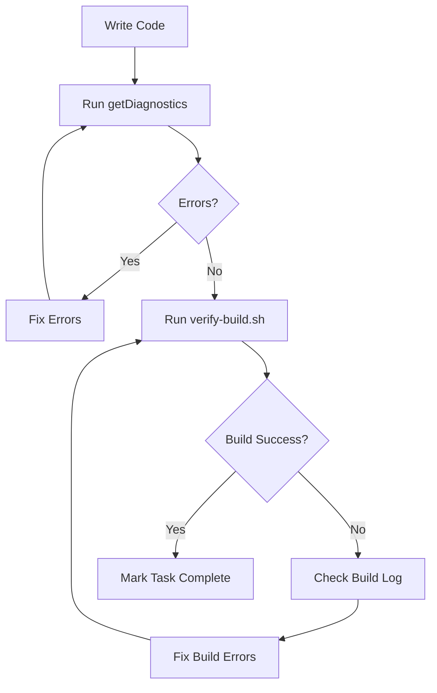

# 🔧 Build Verification Checklist

This checklist helps prevent build errors before they happen.

## ✅ Pre-Implementation Checklist

Before writing any code, verify:

- [ ] Xcode project is open and up-to-date
- [ ] Swift Package dependencies are resolved
- [ ] No existing build errors in Xcode
- [ ] Target iOS version is set correctly (iOS 16.0+)

## ✅ During Implementation Checklist

While writing code:

- [ ] Use `#if os(iOS)` for iOS-specific modifiers:
  - `.textInputAutocapitalization()`
  - `.keyboardType()`
  - Any UIKit-specific features
- [ ] Use platform-agnostic colors:

  ```swift
  // ❌ Don't use:
  Color(.systemGray6)

  // ✅ Use instead:
  #if os(iOS)
  Color(.systemGray6)
  #else
  Color(NSColor.controlBackgroundColor)
  #endif
  ```

- [ ] Import required frameworks:
  - `import Foundation` - Always
  - `import SwiftUI` - For views
  - `import Combine` - For @Published properties
  - `import Supabase` - For Supabase operations

- [ ] Check for common issues:
  - Missing imports
  - Typos in type names
  - Incorrect access modifiers
  - Missing protocol conformances

## ✅ Post-Implementation Checklist

After writing code:

1. **Run Diagnostics**

   ```bash
   # Check for errors in specific files
   # Use getDiagnostics tool in Kiro
   ```

2. **Verify Build**

   ```bash
   # Run automated build verification
   ./scripts/verify-build.sh
   ```

3. **Manual Xcode Check**
   - Open Xcode
   - Press `Cmd + B` to build
   - Check for warnings and errors
   - Fix any issues before proceeding

## 🚨 Common Build Errors & Solutions

### Error: "No such module 'Combine'"

**Solution**: Add `import Combine` at the top of the file

### Error: "'textInputAutocapitalization' is unavailable in macOS"

**Solution**: Wrap in `#if os(iOS)` block

```swift
#if os(iOS)
.textInputAutocapitalization(.never)
#endif
```

### Error: "Cannot find 'Color' in scope"

**Solution**: Add `import SwiftUI`

### Error: "Type 'AuthViewModel' does not conform to protocol 'ObservableObject'"

**Solution**: Add `import Combine` for @Published support

### Error: "Duplicate output file"

**Solution**: Remove duplicate README.md files from subfolders

### Error: "No such module 'Supabase'"

**Solution**:

1. Open Xcode
2. Go to `File > Packages > Resolve Package Versions`
3. Wait for packages to download
4. Clean build folder: `Cmd + Shift + K`
5. Build again: `Cmd + B`

## 🔄 Build Verification Workflow



## 📝 Best Practices

1. **Always verify before marking tasks complete**
   - Run `./scripts/verify-build.sh`
   - Check Xcode for warnings
   - Test on simulator if possible

2. **Use platform-agnostic code**
   - Prefer SwiftUI over UIKit
   - Use `#if os(iOS)` for platform-specific code
   - Test on both iOS and macOS when possible

3. **Keep dependencies minimal**
   - Only import what you need
   - Avoid circular dependencies
   - Use dependency injection

4. **Document platform-specific code**
   - Add comments explaining why `#if os(iOS)` is needed
   - Document alternative approaches for other platforms

## 🛠 Automated Tools

### 1. Build Verification Script

```bash
./scripts/verify-build.sh
```

Automatically builds the project and reports errors.

### 2. Diagnostics Check

Use Kiro's `getDiagnostics` tool to check specific files:

```
getDiagnostics(paths: ["path/to/file.swift"])
```

### 3. Clean Build

```bash
# Clean derived data
rm -rf ~/Library/Developer/Xcode/DerivedData/*

# Clean build folder in Xcode
# Cmd + Shift + K
```

## 📊 Success Metrics

A successful build should have:

- ✅ Zero errors
- ✅ Zero warnings (ideally)
- ✅ All tests passing (when implemented)
- ✅ Clean build log
- ✅ Fast build time (< 2 minutes)

## 🎯 Goal

**Zero build errors on first try!**

By following this checklist, we aim to catch and fix issues during development, not during build time.
